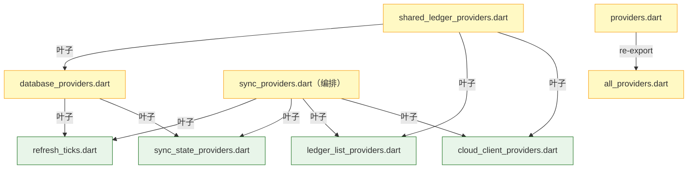
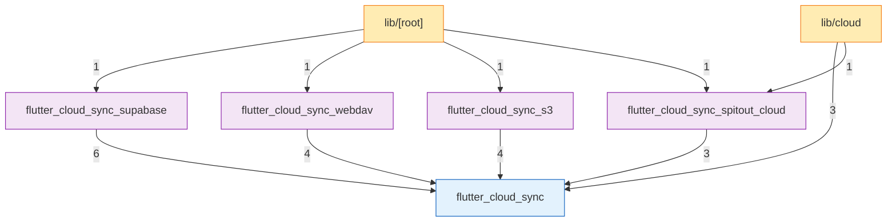
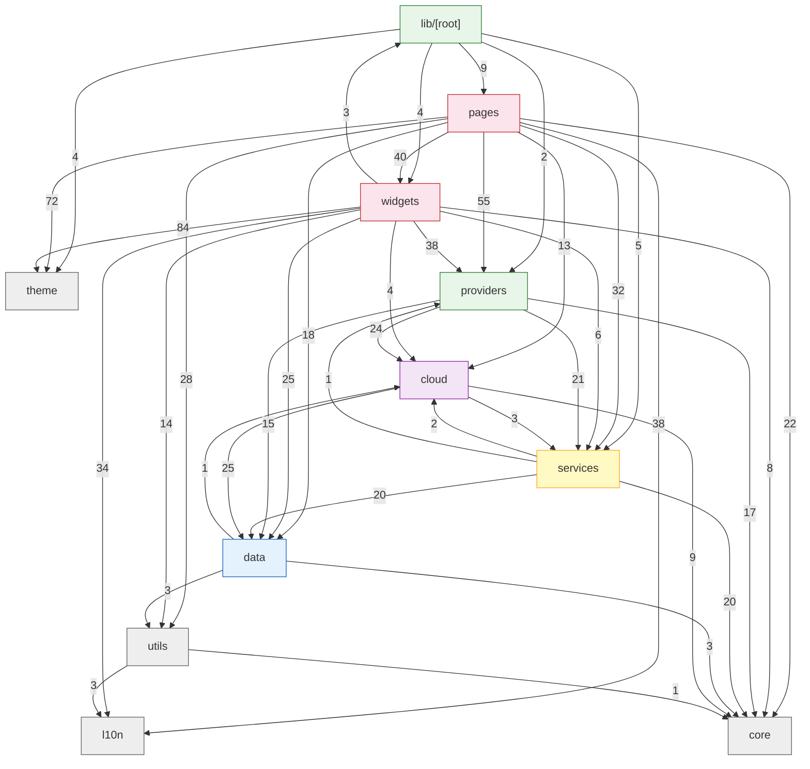

# Spitout 架构分析报告

> 分析类型：feature（架构体检）/ 日期：2026-08-05 / 分析基准：当前工作区代码快照
> 范围：`lib/` 与 `packages/`（不含 `test/`、`build/`、`*.g.dart` 生成文件）

---

## 0. 项目概览

Spitout 是一款个人记账 Flutter 应用（v1.1.1+1，Dart SDK `^3.12.0`），采用“本地优先 + 云同步”的数据架构。技术栈与分层骨架如下：

- **UI 层**：Flutter Material，`pages/`（38 个文件）+ `widgets/`（62 个文件，含大量通用组件与记账编辑 sheet）。
- **状态层**：Riverpod 3.4.2（95 个文件引用），`providers/` 29 个文件，barrel 收敛为 `providers.dart`（39 个消费者）。
- **数据层**：Drift 2.x（SQLite），`data/db.dart`（含 1 个 `db.g.dart` 生成文件）+ 25 个仓储/模型文件。
- **云同步层**：`cloud/` 20 个文件，双栈并存：
  - **Spitout Cloud（增量栈）**：`SyncEngine`（`sync_engine.dart` 约 2300 行 + 7 个 part 文件）基于 `sync_changes` 行级日志 + WebSocket 实时推送；
  - **快照栈**：`TransactionsSyncManager` 基于 `flutter_cloud_sync` 核心包，面向 WebDAV / S3 / Supabase 的整本 JSON 快照上传/下载。
- **本地插件包**：`packages/` 共 5 个包（核心 `flutter_cloud_sync` + 4 个后端适配器），37 个文件。
- **横切支撑**：`core/`（3 个文件：身份、日志）、`theme/`（9）、`utils/`（10）、`l10n/`（4，gen-l10n 生成）。

静态检查结果：

```text
flutter analyze --no-pub
Analyzing Spitout...
No issues found! (ran in 115.9s)
```

`flutter analyze` 零告警，说明 `unused_import` 等基础 lint 完全干净；下述问题均为架构级/风格级问题，而非编译告警。

规模统计（分析时刻）：

| 范围 | 文件数 |
|---|---:|
| `lib/`（排除 `db.g.dart`） | 241 |
| `packages/*/lib/` | 37 |
| 合计纳入分析 | 278 |
| 依赖指令总数（import/export/part） | 1557 |
| 本地依赖边（去重后） | 1176 |
| 其中纯 import 边 | 1051 |
| `test/`（未纳入依赖图） | 149 |
| `drift_schemas/`（生成 schema） | 3 |

---

## 1. 架构与目录结构详解（上下文补充）

### 1.1 目录树与模块清单

```text
lib/
├── [root]            main.dart / app.dart / router.dart / routes.dart   （Composition Root + 唯一路由层）
├── cloud/            20 文件  Spitout Cloud 门面 + 双栈同步引擎
│   ├── spitout_cloud.dart              白名单门面（唯一允许直连适配器的入口）
│   ├── auth_error_localizer.dart       认证错误 → 本地化文案
│   └── sync/                           15 文件  SyncEngine(7 part) / SyncCoordinator /
│                                        SnapshotSyncCoordinator / ChangeTracker / 事务快照
├── core/             3 文件  identity（localSelfId）/ logging（logger）
├── data/             29 文件 Drift schema、models、仓储接口与 LocalRepository
│   ├── db.dart + db.g.dart             表定义与生成代码
│   ├── models*.dart                    领域模型 + barrel
│   └── repositories/                   接口 + local/ 实现 + support/（端口与工具）
├── l10n/             4 文件  gen-l10n 生成（en/zh/ko）
├── pages/            38 文件 8 个功能域（auth/main/cloud/transaction/statistics/settings…）
├── providers/        29 文件 Riverpod 状态层（core/sync/ui/statistics/…）
├── services/         33 文件 业务服务（导入导出/备份/通知/安全/统计/维护）
├── theme/            9 文件  设计令牌与图标
├── utils/            10 文件 纯工具（日期/货币/格式）
└── widgets/          62 文件 通用组件 + 记账编辑器 + widgets.dart barrel（58 exports）

packages/
├── flutter_cloud_sync/                 16 文件 云同步核心（接口 + 注册表 + 通用管理器）
├── flutter_cloud_sync_supabase/         6 文件 Supabase 适配器
├── flutter_cloud_sync_webdav/           4 文件 WebDAV 适配器
├── flutter_cloud_sync_s3/               7 文件 S3/R2/MinIO 适配器
└── flutter_cloud_sync_spitout_cloud/    4 文件 Spitout Cloud 适配器（含 testing/ 测试桩）
```

### 1.2 分层架构说明

| 层 | 职责 | 允许依赖方向 | 代表文件 |
|---|---|---|---|
| entry | 启动装配、全局路由映射、根导航 | pages/widgets/providers/services/theme/l10n | `main.dart`、`app.dart`、`router.dart`、`routes.dart` |
| pages / widgets | 页面与可复用组件 | providers → services → data；theme/l10n/utils | `pages/`、`widgets/` |
| providers | Riverpod 状态、编排、事件分发 | services、data、cloud（经门面）、core | `providers/` |
| services | 无 Riverpod 依赖的业务逻辑 | data、core、utils（不得依赖 providers/UI） | `services/` |
| data | Drift schema、仓储实现、端口定义 | core、utils（端口实现由注入点提供） | `data/` |
| cloud | 同步引擎、变更追踪、双栈协调 | data（仓储）、core；经 `spitout_cloud.dart` 门面触达插件包 | `cloud/` |
| core / utils / theme / l10n | 横切与叶子支撑 | 不反向依赖任何业务层 | `core/`、`utils/`、`theme/`、`l10n/` |

设计约束（代码注释中明确声明）：

1. `routes.dart` 是纯常量叶子，不得 import 任何页面；`router.dart` 是唯一允许把路由名映射到页面实例的文件。
2. `providers.dart` barrel 的子文件禁止 import barrel 自身，子文件间引用须直接 import 同级文件。
3. `data/` 通过 `ChangeRecorder` / `SnapshotDirtyMarker` 端口解耦变更追踪，`cloud/` 实现端口并在 `repositoryProvider` 注入（依赖倒置）。
4. `lib/` 内除 `cloud/spitout_cloud.dart` 与 `main.dart` 外，不得直接 import 插件适配器包。
5. `cloud/spitout_cloud.dart` 使用 `show` 白名单，避免把核心包的 `SyncStatus` 等易冲突类型泄漏到业务层。

### 1.3 关键设计决策

**双栈同步引擎并存（协议原因，不可合并）**：Spitout Cloud 私有协议支持行级 `sync_changes` 游标查询与 WebSocket 实时事件，因此使用增量引擎（`SyncEngine` + `local_changes` 表 + `SyncCoordinator`）；WebDAV/S3/Supabase 只能读写整本 JSON，因此使用快照引擎（`TransactionsSyncManager` + `snapshot_dirty_ledgers` 表 + `SnapshotSyncCoordinator`）。两个协调器在源码注释中互相声明“请勿误删”，删除任一都会让对应后端整类失效。

**Repository 模式 + 端口注入**：`BaseRepository` 聚合 7 个仓储接口；`LocalRepository` 为唯一实现，内部持有可空 `ChangeRecorder` / `SnapshotDirtyMarker`。`providers/core/database_providers.dart` 的 `repositoryProvider` 根据 `CloudBackendType` 选择注入 `ChangeTracker`（Spitout Cloud）或 `SnapshotDirtyTracker`（快照后端），未配置时两者皆空、本地写操作照常执行。

**插件化云同步**：`flutter_cloud_sync` 只定义抽象接口（`CloudProvider`、`CloudAuthService`、`DataSerializer`、`CloudStorageService` 等）与 `CloudProviderRegistry` 注册表；4 个适配器各自暴露 `register*Backend()`，由 `main.dart` 在启动时注册。核心包不 import 任何适配器。

**Provider 叶子模块拆分**：为避免 providers 组内环，`sync_state_providers.dart`（云配置 + 各类刷新 tick）、`refresh_ticks.dart`（跨域 tick + 首屏缓存）、`cloud_client_providers.dart`（云客户端/引擎基础设施）、`ledger_list_providers.dart`（账本列表）被拆为叶子；`sync_providers.dart` 只做编排，`database_providers.dart` 只依赖叶子。

**PostProcessor 三载体统一**：`PostProcessor` 以 `_Read` typedef 收敛 `WidgetRef` / `ProviderContainer` / `Ref` 三种入口，保证 UI、后台服务与 Provider 内部走同一份“统计刷新 + 同步触发”逻辑。

### 1.4 子模块详解：Provider 叶子拆分的内部依赖



该结构保证 providers 组内依赖单向：`database_providers.dart` 只依赖叶子 provider（`sync_state_providers.dart` / `refresh_ticks.dart`），不 import 编排器；`shared_ledger_providers.dart` 同样只依赖叶子 + database + ledger_list，踢人/退出流程可以安全 invalidate `localLedgersProvider` 而不产生反向边。

### 1.5 AA 分摊功能设计意图

AA 分摊功能域的完整文件分布与契约设计如下：

| 层 | 文件 | 职责 |
|---|---|---|
| services | `services/statistics/aa_statistics_service.dart`（`computeLedger` 在 :272）、`aa_edit_models.dart`、`aa_decimal_util.dart` | 纯计算与页面契约，不写库 |
| providers | `providers/statistics/aa_statistics_providers.dart`（`aaStatisticsProvider` 在 :338，数据组装 :357-361，`computeLedger` 调用 :417）、`aaEnabledProvider`、虚拟用户 CRUD 动作 | 状态入口 |
| pages | `pages/statistics/aa_edit_page.dart`（纯选择器，不写库）、`aa_statistics_page.dart` | UI |
| widgets | `aa_payer_picker_sheet.dart`、`transaction_aa_edit_utils.dart`、`virtual_user_manage_sheet.dart` | 复用组件与详情页编辑入口 |
| data | `repositories/ledger_virtual_user_repository.dart`（`getByLedger` :17）+ `local/local_ledger_virtual_user_repository.dart` | 虚拟用户数据层 |
| cloud/sync | `sync_engine_serialization.dart:112-119`（`virtual_user` 推送）、`sync_engine_apply.dart:36`（`virtual_user` 应用）、`transactions_json.dart:195`（快照 v7 含 AA 字段与 `virtualUsers` 数组） | 同步序列化/反序列化 |
| 路由 | `routes.dart:15/19`（`Routes.aaStatistics` / `Routes.aaEdit`）、`router.dart:22/31` 两个 case | 命名路由解耦，页面间零直接 import |

同步契约要点：

- 推送侧“非空才发”：`transactions_json.dart:118-124` 对 `paidByUserId` / `aaMode` / `aaParticipants` / `aaSplits` 均加非空守卫后才写 JSON。
- 应用侧“缺键保护”：`sync_engine_apply.dart:174-185` 逐个 `payload.containsKey(...)` 判断，`:226-237` 缺键时 `Value.absent()` 保留本地值（老 server payload 兼容）；`:153` 注释明确“缺键不覆盖本地”。
- 虚拟用户随账本快照导出（`transactions_json.dart:178-179`：避免 `aaParticipants` / `aaSplits` 引用悬空）。
- 新增依赖 `decimal`（广度 3）仅用于 AA 高精度分摊计算，用途合理。

该功能域全部落在既有分层内，未引入新的跨层或反向依赖边。

---

## 2. 模块依赖图

边权重 = 两个目录/包之间的指令条数（import + export + part，去重前）。分析结论先行：**顶层图无环**；`lib/` 内部存在 2 个目录级 SCC（详见第 4 章）。

### 2.1 顶层图（`lib/` ↔ `packages/`）



符合插件化设计：

- 依赖方向严格为 `适配器包 → 核心包`，核心包对适配器零感知（`CloudProviderRegistry` 中无任何 adapter import）。
- 主应用只在 `main.dart` 的 Composition Root 直接 import 4 个适配器包（各 1 条），且仅用于 4 行注册。
- `lib/cloud` 只通过 `spitout_cloud.dart` 门面（1 条 export）触达 Spitout Cloud 适配器，通过核心包（3 条）使用通用接口。
- 没有任何包反向 import `lib/`，`packages/` 与主应用之间无环。

### 2.2 详细层图（`lib/` 内部）



图注：

- 同目录内部依赖未入图（属于正常组内耦合）：`widgets→widgets` 128 条、`providers→providers` 81 条、`data→data` 63 条、`cloud→cloud` 26 条、`pages→pages` 33 条。
- 横切热点（高入度）不参与分层判断：`l10n`（pages 38 + widgets 34）、`theme`（pages 72 + widgets 84）被大量消费属正常现象。
- **反向/回边（风险点，详见第 7 章）**：
  - `data → cloud`（1 条：`data/models.dart:62` re-export `cloud/spitout_cloud.dart`）；
  - `services → providers`（1 条：`me_placeholder_migration_service.dart:8`）；
  - `cloud → services`（3 条：`sync_diff_service.dart:5`、`transactions_json.dart:6`、`sync_engine.dart:22`）；
  - `pages → [root]`（2 条：`home_page.dart:22`、`mine_page.dart:9` import `routes.dart`）与 `widgets → [root]`（3 条，同样 import `routes.dart`）。

---

## 3. 关键调用链路

> 行号基于 2026-08-05 分析时刻的快照；`→` 表示调用/订阅关系。

### 3.1 应用冷启动装配

| 步骤 | 调用序列 |
|---|---|
| ① | `main.dart:39-42` `main()` → `registerSupabaseBackend() / registerWebDavBackend() / registerS3Backend() / registerSpitoutCloudBackend()`（适配器自注册进 `CloudProviderRegistry`） |
| ② | `main.dart:64-75` `main()` → `NotificationFactory.initializeTimeZone()` / `NotificationFactory.getInstance().initialize()`（通知初始化，失败降级日志） |
| ③ | `main.dart:78-84` `main()` → `ProviderContainer()` + 注册 `SpitoutCloudProvider.globalTwoFactorHandler`（2FA 弹窗桥接） |
| ④ | `main.dart:95-100` `main()` → `Future.wait([welcomeCheckProvider.future, appSplashInitProvider.future])` → `runApp(UncontrolledProviderScope(...))` |
| ⑤ | `providers/ui/ui_state_providers.dart:46-151` `appSplashInitProvider` → 并行初始化主题/显示名/安全/可见币种 → `repositoryProvider` 预加载“月度统计 + 前 20 条交易”到 `cachedTransactionsProvider` → `RecurringTransactionService.generatePendingTransactionsStatic()` → `PostProcessor.runR()` 逐账本触发同步 |
| ⑥ | `app.dart:60-76` `_SpitoutAppState.initState()` → `ref.read(appStartupSyncProvider).start()` + 预热 `categoryPickerTreeProvider` + `autoBackupOnLaunch` + `migrateMePlaceholderOnLaunch` |
| ⑦ | `providers/sync/app_startup_sync.dart:21-28` `AppStartupSync` 构造期 `ref.listen(syncServiceProvider)`，等服务从 `LocalOnlySyncService` 变为 `SyncEngine` 时补一次初始化同步 |
| ⑧ | `app_startup_sync.dart:56-62` `start()` → eager-await `spitoutCloudProviderInstance.future`（强制恢复 session） |
| ⑨ | `app_startup_sync.dart:66-90` `start()` → 快照栈走 `TransactionsSyncManager.refreshAllLedgersStatus()`；增量栈走 `_triggerInitialCloudSync()` → `SyncEngine.syncAccount()`（5 秒幂等闸） |
| ⑩ | `pages/auth/welcome_page.dart:330-390` `_finishWelcome()`（首次启动）→ `SeedService.ensureSeed()` → `selectFirstLedger()` → `ref.invalidate(appSplashInitProvider)` 重跑预加载 |

### 3.2 核心业务写入（新增/编辑记录）

| 步骤 | 调用序列 |
|---|---|
| ① | `app.dart:180` `SpitoutBottomBar.onCenterTap` → `showTransactionEditorSheet(context, initialKind: 'expense')` |
| ② | `widgets/transaction_editor_sheet_entry.dart:31-84` `showTransactionEditorSheet` → `showModalBottomSheet` → `TransactionEditorSheet` |
| ③ | `transaction_editor_sheet.dart:557` `_onSubmit()` → AA 分流解析 → `transaction_editor_sheet.dart:607` `repo.updateTransaction(...)` 或 `:651` `repo.addTransaction(...)` |
| ④ | `transaction_editor_sheet.dart:625/669` → `markTxEditedFromUi / markTxCreatedFromUi`（共享账本回填编辑人）→ `:673` `PostProcessor.sync(ref, ledgerId:)` |
| ④a | `shared_ledger_providers.dart:334/346` `markTxCreatedFromUi/markTxEditedFromUi` → `services/data/tx_author_service.dart` 回填 `createdByUserId` / `lastEditedByUserId` / `paidByUserId`（为空时取操作者；AA 分摊的“默认支出人 = 创建人”语义由此落地） |
| ⑤ | `data/repositories/local/local_repository.dart:348-405` `LocalRepository.addTransaction()` → 子仓储写入 Drift → `changeTracker!.recordLedgerChange(entityType:'transaction', action:'create')`（写 `local_changes` 表；快照后端则由 `local_ledger_repository.dart:168` 写 `snapshot_dirty_ledgers`） |
| ⑥ | `providers/core/post_processor.dart:104-135` `_doSync()` → `syncServiceProvider.markLocalChanged()` → bump `syncStatusRefreshProvider` / `ledgerListRefreshProvider` |
| ⑦ | `post_processor.dart:113-127` → 若 `sync is SyncEngine`：fire-and-forget `engine.sync(ledgerId)`；否则读 `auto_sync` 开关，开启时 `sync.uploadCurrentLedger(ledgerId:)` |
| ⑧ | `transaction_editor_sheet.dart:674-676` → `ref.invalidate(countsForLedgerProvider)` + `statsRefreshProvider++`（UI 刷新） |

### 3.3 反应式自动同步（本地变更驱动）

| 步骤 | 调用序列 |
|---|---|
| ① | 任意仓储写操作 → `ChangeTracker.recordLedgerChange/recordUserGlobalChange`（`cloud/sync/change_tracker.dart`）写入 `local_changes`（本地账本除外，有 `isLocalLedger` 闸门） |
| ② | `cloud/sync/sync_coordinator.dart:39-48` `SyncCoordinator.start()` → `db.select(localChanges).watch()` 订阅未推送行 |
| ③ | `sync_coordinator.dart:50-62` `_onUnpushedChanged()` → 250ms debounce → `engine.triggerAutoSync(reason:'local_change_detected')` |
| ④ | `cloud/sync/sync_engine_realtime.dart:126-127` `triggerAutoSync()` → `_scheduleAutoSync()`（2 秒防抖 + 单飞合并） |
| ⑤ | `sync_engine.dart:868` `SyncEngine.sync()` → 判断 fullPush 或增量：`sync_engine.dart:1748` `_doPush()`（先 `pushUserGlobalEntities()` 推 user-global，再逐 ledger 推）→ `:1897/:1941` `pull()` / `_doPull()` 拉远端 |
| ⑥ | 推送成功 → `markPushed` 清理 `local_changes` → `SyncEvent.PushCompleted` → `sync_providers.dart:207-213` listener bump `syncStatusRefreshProvider` |
| ⑦ | 快照栈：`local_repository` 写 `snapshot_dirty_ledgers` → `snapshot_sync_coordinator.dart:68-79` `start()` watch → `:92` 500ms debounce → `:111` `_uploadDirtyLedgers()` → `auto_sync` 闸门 → `syncService.uploadCurrentLedger()` → 成功后 DELETE 脏行 |
| ⑧ | 网络恢复旁路：`sync_providers.dart:270-283` `Connectivity().onConnectivityChanged` → 500ms debounce → `engine.triggerAutoSync(reason:'connectivity_restored')` |

### 3.4 登录 / 认证流程

| 步骤 | 调用序列 |
|---|---|
| ① | `pages/auth/login_page.dart:338-339` → `ref.read(authServiceProvider.future)` → `auth.signInWithEmail(email:, password:)` |
| ② | `login_page.dart:343-344` → `_saveCredentials(email, pwd)`（记住账号） |
| ③ | `login_page.dart:351-359` → `ref.invalidate(authServiceProvider)` → `ref.invalidate(spitoutCloudProviderInstance)` → `ref.invalidate(syncServiceProvider)`（Provider 级联失效重建，`syncServiceProvider` watch 到新 session 后重建 `SyncEngine`） |
| ④ | `login_page.dart:361-377` → `syncStatusRefreshProvider++` → `bottomTabIndexProvider = 3` → `Navigator.pop()` |
| ⑤ | `providers/sync/cloud_client_providers.dart:140-199` `spitoutCloudProviderInstance` 重建 → `cloudServicesFactoryProvider` → `createCloudServices(config)` → 若 `auth is SpitoutCloudAuthService` 则 `setRecoveryCredentials(email, password)`（session 失效自动恢复） |
| ⑥ | `cloud_client_providers.dart:120-138` `cloudCurrentUserProvider` → `_seedThenFollow(auth)`：先 `auth.currentUser` 快照种子，再 `authStateChanges` 流跟随（登录/登出/Token 恢复即时驱动 UI） |
| ⑦ | 错误文案统一走 `cloud/auth_error_localizer.dart:32` `friendlyAuthError()`（Supabase `AuthApiException.code` → CloudAuthException → 网络异常 → 兜底关键词匹配） |

### 3.5 首页列表 / 统计数据读取

| 步骤 | 调用序列 |
|---|---|
| ① | `providers/core/database_providers.dart:96-103` `currentLedgerProvider` → `repo.watchLedger(ledgerId)`（Drift Stream 订阅，B 端改设置 A 端自动刷新） |
| ② | `providers/ui/ui_state_providers.dart:46-130` 启动预加载 → `monthlyTotalsProvider(...).future` + `repo.getRecentTransactionsWithCategory(limit: 20)` → 写入 `cachedTransactionsProvider`（首屏零闪烁） |
| ③ | `pages/main/home_page.dart:1188` `StreamBuilder` 订阅完整交易流；`:1161/:1169` watch `currentLedgerProvider` + `ledgerMembersProvider(ledger.syncId!)` |
| ④ | `providers/statistics/statistics_providers.dart:22-30` `monthlyTotalsProvider` → watch `statsRefreshProvider`（每次写操作后 bump 重算）→ `repo.monthlyTotals()` |
| ⑤ | `statistics_providers.dart:45-53` `todayExpenseProvider` / `:64-71` `weekExpenseProvider` 同模式；`calendar_providers.dart:17-24` `dailyTotalsByMonthProvider` watch `calendarRefreshProvider` |
| ⑥ | 同步拉取落地后：`sync_providers.dart:173-205` 收到 `PullCompleted(applied>0)` → 统一 bump `syncStatusRefreshProvider / ledgerListRefreshProvider / syncGenerationProvider / statsRefreshProvider / calendarRefreshProvider`，并 `homeSwitchToStreamProvider++` 切到 Stream 模式 |
| ⑦ | AA 统计读取：`ref.watch(aaStatisticsProvider(ledgerId))`（`aa_statistics_providers.dart:338`）→ `repo.getAaTransactionsByLedger` + `repo.getByLedger`（虚拟用户）+ `ledgerMembersProvider`（真实成员）→ `AaStatisticsService.computeLedger`（`aa_statistics_service.dart:272`，纯计算不写库） |

### 3.6 跨端同步上行 / 下行（含云端 Profile 双向同步）

| 步骤 | 调用序列 |
|---|---|
| ① 上行（增量） | `PostProcessor._doSync` → `SyncEngine.sync` → `_doPush`（`sync_engine.dart:1748`）→ `pushUserGlobalEntities()`（category 等，`ledgerId=0` 全局通道）→ `getUnpushedChangesForLedger` → 序列化 → 云端 API 推送 → `markPushed` |
| ② 下行（增量） | `SyncEngine.pull`（`sync_engine.dart:1897`）→ `_doPull`（`:1941`）读游标 → `_runPullLoop`（`:1975`）分页 → `_applyPullPage` → part 扩展 `SyncEngineApplyExt` 逐实体 upsert → `ChangeTracker.recordPulledFromServer`（防止回推回声） |
| ③ 上行（快照） | `transactions_sync_manager.dart:145-209` `uploadCurrentLedger()` → `exportTransactionsJson(db, ledgerId)` → 计算指纹 → `_syncManager.upload(data: ledgerId, path:'ledger_<id>.json', metadata:…)` → 更新状态缓存 |
| ④ 下行（快照） | `transactions_sync_manager.dart:211` `downloadAndRestoreToCurrentLedger()` → 下载 JSON → 导入合并（`services/import/data_import_service.dart`，按 `syncId` 去重）→ `:259` `pullIncremental()` 为同一路径的幂等封装 |
| ⑤ Profile 上行 | `sync_providers.dart:470-512` `reconcileProfileToServer()` → `cloud.getMyProfile()` → server 缺失时补推 `appearance` / `displayName` / 本地头像 |
| ⑥ Profile 下行 | `SyncEngine.syncMyProfile()`（part：`sync_engine_profile.dart`）拉取并 apply → 发 `ProfileFieldApplied` 事件 → `sync_providers.dart:522-540` `_applyDisplayNameFromServer / _applyAppearanceFromServer` 回写 Riverpod 与 SharedPreferences（相同值不写，防 echo 环） |
| ⑦ 实时通道 | `sync_engine_realtime.dart:10` `startListeningRealtime()` → WebSocket 收到 `profile_change` → `:36` `_scheduleAutoSync('ws_connected')` → 自动 pull |
| ⑧ AA 字段同步（增量） | `sync_engine_serialization.dart:14` `_serializeEntityForPush('transaction')` → `EntitySerializer.serializeTransaction`（AA 字段“非空才发”，`transactions_json.dart:118-124` 同守卫）→ 对端 `sync_engine_apply.dart:174-185` 逐键 `containsKey` 判断 → `:226-237` 缺键 `Value.absent()` 保留本地 |
| ⑨ 虚拟用户同步 | `sync_engine_serialization.dart:112-119` 推送 `virtual_user`（ledger-scoped）→ `sync_engine_apply.dart:36` 应用；快照导出 `transactions_json.dart:195-196`（v7：AA 字段 + `virtualUsers` 数组，导出顺序按 id 升序保证稳定） |

### 3.7 协作 / 共享功能

| 步骤 | 调用序列 |
|---|---|
| ① 邀请预览 | `pages/cloud/join_shared_ledger_page.dart:68` → `previewInvite(ref, code:)` → `shared_ledger_providers.dart:178` → `cloud.previewInvite(code:)` |
| ② 接受邀请 | `join_shared_ledger_page.dart:89` → `acceptSharedLedgerInvite()` → `shared_ledger_providers.dart:150-176` → `acceptInvite()`（`cloud.acceptInvite`）→ `engine.onInviteAccepted(ledgerExternalId)`（`sync_engine_realtime.dart:349`，拉账本元数据）→ invalidate `localLedgersProvider` + bump `ledgerListRefresh / syncGeneration / statsRefresh` |
| ③ 发邀请 | `shared_ledger_providers.dart:80-114` `createInviteAndRefresh()` → 先 `engine.pushUserGlobalEntities()`（防“云端空快照”，失败重试一次后抛 `CategorySyncBeforeInviteException`）→ `cloud.createInvite()` → invalidate `ledgerInvitesProvider` |
| ④ 成员变化刷新 | WS `member_change` → `sync_engine_realtime.dart:133` `_handleMemberChange()` → 被踢则 `_purgeLocalLedgerByExternalId` 清本地；新成员加入触发同步；UI 侧 `ledgerMembersProvider`（`shared_ledger_providers.dart:31-39`）watch `sharedResourceRefreshProvider` 自动重拉 |
| ⑤ 踢人/退出 | `shared_ledger_providers.dart:190-219` `removeMemberAndRefresh()` → `cloud.removeMember()` → `engine.syncLedgersFromServer()` 同步成员数 → invalidate `ledgerMembersProvider / localLedgersProvider / currentLedgerProvider` |
| ⑥ AA 参与人刷新 | `aaParticipantOptionsProvider` / `aaStatisticsProvider` / `memberExpenseStatsProvider` 均 watch `sharedResourceRefreshProvider`（`refresh_ticks.dart`）→ 成员/虚拟用户变更后名册与 AA 统计自动重算 |

---

## 4. 循环依赖检测

### 4.1 文件级结果（Tarjan SCC）

**纯 import 环：1 个（良性，生成代码）**

| 环成员 | 边 | 性质 |
|---|---|---|
| `lib/l10n/app_localizations.dart` ↔ `app_localizations_en.dart` ↔ `app_localizations_ko.dart` ↔ `app_localizations_zh.dart` | `app_localizations.dart:7/9/10` import 三个生成文件；生成文件第 3 行 import 基类 | `flutter gen-l10n` 的标准结构（基类注册 delegate，子类继承基类），**建议保留**；任何“解耦”都会被重新生成覆盖 |

**全指令（import + export + part）环：3 个**，其中 2 个需要专门说明：

| 环 | 成因 | 结论 |
|---|---|---|
| `sync_engine.dart` ↔ 7 个 `sync_engine_*.dart` | 7 个文件是 `sync_engine.dart` 的 **part**（`part 'sync_engine_apply.dart';` 等），不是 import 回边 | **不是循环依赖**，是单库多文件组织；Dart 中 part 共享同一库作用域。静态扫描按指令计数会误报，本报告已按“part 合并进主库”重新判定 |
| `widgets/ledger_currency_change.dart` ↔ `widgets/widgets.dart` | `ledger_currency_change.dart:9` import barrel；`widgets.dart:52` export 它 | **真实的自引用 barrel 回边**（详见 4.3） |
| l10n 四文件环 | 同上 | 良性生成环 |

### 4.2 目录级 SCC

**SCC-1：`lib/providers → lib/data → lib/cloud → lib/services`（四节点环）**

| 边 | 证据（文件:行号） | 用途 |
|---|---|---|
| data → cloud | `lib/data/models.dart:62` `export 'package:spitout/cloud/spitout_cloud.dart'` | 数据层 barrel 把云端类型 re-export 给 42 个消费者 |
| cloud → services | `lib/cloud/sync/sync_diff_service.dart:5`、`lib/cloud/sync/transactions_json.dart:6`（import `data_import_service.dart`）；`lib/cloud/sync/sync_engine.dart:22`（import `avatar_storage.dart`） | 同步引擎复用导入合并服务与头像存储服务 |
| services → providers | `lib/services/data/me_placeholder_migration_service.dart:8` `import 'package:spitout/providers/core/database_providers.dart'` | 服务层需要 `databaseProvider` 取数据库实例 |
| providers → data（正常） | `providers/core/database_providers.dart` 等 15 条 | 状态层依赖数据层，符合方向 |
| providers → cloud（正常但偏强） | `providers/sync/*` 24 条 | 编排层依赖云端引擎 |

成因与解耦方案：

1. **`data/models.dart` 反向 re-export cloud**：数据层 barrel 同时承担云端类型出口，职责混杂。修复方向：把 Spitout Cloud 类型出口从 `models.dart` 移除，42 个消费者按需改 import `cloud/spitout_cloud.dart` 或拆分的 `data/models/sync_models.dart`；可配合 Codemod 一次性替换。
2. **服务层上行依赖 providers**：`me_placeholder_migration_service` 只为拿 `databaseProvider`。修复方向：构造注入 `SpitoutDatabase db`（调用方 `app.dart:76` 已持有 `ref.read`），或把该迁移职责上移到 providers 层（它本质是启动编排）。
3. **cloud 依赖 services**：`data_import_service` 的“JSON 合并导入”与 `avatar_storage` 的路径能力被同步引擎复用。修复方向：在 `cloud/` 定义端口接口（如 `SyncMergePort` / `AvatarStoragePort`），由 providers 装配点注入 services 实现；或将合并逻辑下沉到 `data/` 层（它本身只依赖 Drift）。

**SCC-2：`lib/pages → lib/[root] → lib/widgets`（三节点环）**

| 边 | 证据 | 用途 |
|---|---|---|
| pages → [root] | `pages/main/home_page.dart:22`、`pages/main/mine_page.dart:9` import `routes.dart` | 拿路由名常量 |
| [root] → pages | `app.dart:6-11`、`main.dart:18-19`、`router.dart:4-6` 共 9 条 | 页面实例化 |
| widgets → [root] | `widgets/category_grid_section.dart:8`、`widgets/transaction_aa_edit_utils.dart:11`、`widgets/transaction_editor_sheet.dart:13` import `routes.dart` | 拿路由名常量 |
| [root] → widgets | `app.dart:14`、`main.dart:13-14` 共 3 条 | 根组件使用通用组件 |

成因：**`routes.dart` 是纯常量叶子，但被归入 `[root]` 分组**，而 `[root]` 又包含 import pages/widgets 的 `app.dart/main.dart/router.dart`，导致目录粒度上的假环。修复方向（低风险、高收益）：

- 把 `routes.dart` 移入叶子目录（如 `lib/core/routes.dart`）或把 `[root]` 拆成 `entry/` 与 `routes/` 两个分组，环即消失；
- 保持“页面间不互相 import、只经 `router.dart` 映射”的现有设计不变。

**SCC-3：`flutter_cloud_sync_spitout_cloud/[root] ↔ src/testing`（包内 barrel 互导）**

`flutter_cloud_sync_spitout_cloud.dart` 导出 `src/testing/…`（测试桩），`src/testing/fake_spitout_cloud_provider.dart` 又 import 包根 barrel。修复方向：根 barrel 不导出测试桩（测试桩只由测试经 `packages/.../lib/testing.dart` 引用，该入口目前 0 消费者属设计合理）；fake 文件改 import 具体 `src/spitout_cloud_provider.dart`。

### 4.3 文件级真问题：widgets barrel 自引用

```text
lib/widgets/widgets.dart:52  export 'ledger_currency_change.dart';
lib/widgets/ledger_currency_change.dart:9  import 'widgets.dart';   ← 回边
```

- 用途：`ledger_currency_change.dart` 需要 barrel 里的 `showToast` 等符号（`ledger_currency_change.dart:49/130/132`）。
- 外部消费者：`pages/currency/exchange_rate_page.dart:458` 与 `pages/main/ledger_edit_page.dart:906` 经 barrel 调用 `applyLedgerCurrencyChange`（export 本身有消费者，不能直接删）。
- 解耦方案：把 `ledger_currency_change.dart:9` 的 barrel import 改为直接 import 所需文件（如 `toast.dart`）；`exchange_rate_page.dart` / `ledger_edit_page.dart` 改为直接 import `ledger_currency_change.dart`，随后可把该 export 从 barrel 移除。

---

## 5. 外部依赖清单（声明 vs 实际使用）

按引用广度排序（`lib/` + `packages/` 内文件数；`flutter` SDK 与本地 5 个包单列）。

| 依赖 | 引用文件数 | 主要用途域 | 状态 |
|---|---:|---|---|
| flutter | 120 | UI/框架 | 活跃 |
| flutter_riverpod | 95 | 状态管理 | 活跃 |
| shared_preferences | 28 | 配置/持久化开关 | 活跃 |
| drift | 25 | SQLite ORM | 活跃 |
| intl | 15 | 本地化/日期 | 活跃 |
| uuid | 9 | 实体 syncId | 活跃 |
| http | 6 | HTTP 客户端（S3、Spitout Cloud、汇率、更新检查） | 活跃 |
| path_provider | 6 | 文件路径 | 活跃 |
| supabase_flutter | 6 | Supabase 适配器（5）+ **`lib/cloud/auth_error_localizer.dart`（1，见风险 M3）** | 活跃/泄漏点 |
| crypto | 5 | 指纹/签名/锁屏散列 | 活跃 |
| path | 5 | 路径拼接 | 活跃 |
| decimal | 3 | AA 分摊高精度计算 | 活跃 |
| file_picker | 3 | 导入导出选文件 | 活跃 |
| flutter_local_notifications | 3 | 记账提醒 | 活跃 |
| meta | 3 | 核心包注解 | 活跃（仅核心包） |
| package_info_plus | 3 | 版本信息/设备 UA | 活跃 |
| share_plus | 3 | 导出/日志分享 | 活跃 |
| timezone | 3 | 通知时区 | 活跃 |
| fl_chart | 2 | 图表 | 活跃 |
| flutter_list_view | 2 | 交易列表滚动 | 活跃 |
| flutter_localizations | 2 | Material 本地化 | 活跃 |
| lucide_icons_flutter | 2 | 图标体系 | 活跃 |
| webdav_client | 2 | WebDAV 适配器 | 活跃（仅适配器） |
| connectivity_plus | 1 | 网络恢复触发同步 | 单薄但合理 |
| csv | 1 | CSV 导出 | 单薄但合理 |
| device_info_plus | 1 | Spitout Cloud 设备信息 | 活跃（仅适配器） |
| excel | 1 | XLSX 导入 | 单薄但合理 |
| flutter_svg | 1 | 品牌图标 | 单薄但合理 |
| gbk_codec | 1 | GBK 文本解码 | 单薄但合理 |
| image_picker | 1 | 头像选择 | 单薄但合理 |
| local_auth | 1 | 生物识别锁屏 | 单薄但合理 |
| permission_handler | 1 | 公共导出目录权限 | 单薄但合理 |
| reorderable_grid_view | 1 | 分类拖拽排序 | 单薄但合理 |
| sqlite3 | 1 | 本地备份只读校验（`local_backup_service.dart`） | 活跃（显式提升为直接依赖，pubspec 注释说明原因） |
| table_calendar | 1 | 日历页 | 单薄但合理 |
| url_launcher | 1 | 更新跳转 | 单薄但合理 |
| visibility_detector | 1 | 列表可见性 | 单薄但合理 |
| web_socket_channel | 1 | Spitout Cloud 实时通道 | 活跃（仅适配器） |
| xml | 1 | S3 ListBucket XML 解析 | 活跃（仅适配器） |
| yaml | 1 | 配置导出 | 单薄但合理 |
| sqlite3_flutter_libs | 0 | 原生 SQLite 二进制 | **保留（零 import 属预期）**：pubspec 注释明确“无 Dart API，仅用于打包原生二进制供 Drift FFI 加载，勿删” |

本地包声明核对：

| 包 | 声明依赖 | 实际引用 |
|---|---|---|
| flutter_cloud_sync（核心） | meta、shared_preferences | meta 3 文件、shared_preferences 1 文件（`cloud_service_store.dart`），均使用 |
| flutter_cloud_sync_supabase | supabase_flutter | 6 文件全部使用 |
| flutter_cloud_sync_webdav | http、webdav_client | 均使用 |
| flutter_cloud_sync_s3 | http、crypto、xml | 均使用 |
| flutter_cloud_sync_spitout_cloud | crypto、device_info_plus、http、package_info_plus、shared_preferences、web_socket_channel | 均使用 |

结论：

- **无“声明但未引用”的运行时依赖**（唯一零引用项 `sqlite3_flutter_libs` 是有意保留的原生依赖）。
- dev_dependencies（`build_runner` / `drift_dev` / `mocktail` / `flutter_launcher_icons` / `flutter_lints`）用于生成与测试，属正常。
- 单薄依赖均对应单一明确功能域（导入导出、通知、安全、图表），当前没有必须合并的候选；`connectivity_plus` 与 `SyncEngine` 自带的重试/WS 重连有功能重叠，但作为“网络恢复旁路”保留合理。
- **建议**：`supabase_flutter` 在 `lib/cloud/auth_error_localizer.dart` 的直接引用是适配器 SDK 向应用 lib 的泄漏，建议下沉到 Supabase 适配器包（见 M3）。

---

## 6. 插件化架构专项（packages/）

### 6.1 依赖方向

```text
适配器包（supabase/webdav/s3/spitout_cloud）──单向──▶ 核心包 flutter_cloud_sync
主应用 main.dart（仅注册）──▶ 适配器包
lib/cloud/spitout_cloud.dart（唯一门面）──▶ 核心包 + spitout_cloud 适配器
```

- 核心包 `flutter_cloud_sync` 的 16 个文件全部只依赖自身与 Dart/Flutter/meta/shared_preferences，**零适配器感知**（`cloud_provider_registry.dart` 是静态注册表，无任何 adapter import）。
- 适配器包全部 `import 'package:flutter_cloud_sync/...'`，无任何反向依赖；无任何包 import 主应用 `lib/`。
- 主应用 `lib/` 只有 2 处直接触达适配器：`main.dart:39-42`（注册）与 `cloud/spitout_cloud.dart`（白名单门面）；其余 20 个 cloud 文件、全部 providers 都经门面/核心包获取类型。

### 6.2 barrel 健康度

| 文件 | exports | 消费者 | 评价 |
|---|---:|---:|---|
| `flutter_cloud_sync.dart` | 15 | 19 文件 | 全部为接口/契约，`DataSerializer`、`CloudStorageService`、`CloudSyncManager` 等均有实现方或调用方；健康 |
| `flutter_cloud_sync_supabase.dart` | 5 | main.dart | 注册契约 + 类型出口，健康 |
| `flutter_cloud_sync_webdav.dart` | 3 | main.dart | 同上 |
| `flutter_cloud_sync_s3.dart` | 2 | main.dart | 同上 |
| `flutter_cloud_sync_spitout_cloud.dart` | 1 | main.dart + 包内测试桩 | 同上 |
| `flutter_cloud_sync_spitout_cloud/testing.dart` | 1 | 0 | 测试专用入口，**0 消费者属设计合理**（供测试与示例使用） |
| `lib/cloud/spitout_cloud.dart` | 2（均带 show 白名单） | 22 文件 | 健康：白名单防止 `SyncStatus` 等易冲突类型泄漏 |

### 6.3 Composition Root 装配

`main.dart:39-42` 共 4 行注册（4 个后端，非示例中的 3 行）：

```dart
registerSupabaseBackend();
registerWebDavBackend();
registerS3Backend();
registerSpitoutCloudBackend();
```

符合插件化最佳实践：注册点无业务逻辑、核心包不感知适配器、未注册后端在 `createCloudServices` 处抛 `StateError` 提示补注册。唯一的“注册期副作用”是 `SpitoutCloudProvider.globalTwoFactorHandler` 在 `main.dart:83` 的回调桥接，属于 UI 能力的合理注入，不构成业务耦合。

### 6.4 核心包是否包含业务专属实现

核心包不含任何业务专属代码（无“记账”“账本”“交易”字样类型）。业务专属实现位于主应用 `lib/cloud/`（SyncEngine、ChangeTracker）与 Spitout Cloud 适配器包，归属正确。

**一个待剥离点**：`lib/cloud/auth_error_localizer.dart:5` 直接 `import 'package:supabase_flutter/...'`，导致主应用 lib 感知 Supabase SDK。建议：

- 在核心包 `CloudAuthException` 上增加可选 `code` 字段（或定义 `AuthErrorClassifier` 抽象）；
- Supabase 适配器在 `signInWithEmail` 捕获 `AuthApiException` 后映射为带 `code` 的 `CloudAuthException`；
- `friendlyAuthError` 只依赖核心包类型，删除对 `supabase_flutter` 的 import。

---

## 7. 架构一致性偏差（按严重度分级）

### 高（影响分层方向或环结构）

| # | 偏差 | 证据 | 修复方向 |
|---|---|---|---|
| H1 | 数据层 barrel 反向 re-export 云层（data → cloud） | `lib/data/models.dart:62` export `cloud/spitout_cloud.dart` | 从 `models.dart` 移除云端类型出口；消费者改 import `cloud/spitout_cloud.dart` 或独立 `sync_models.dart` |
| H2 | 服务层上行依赖状态层（services → providers） | `lib/services/data/me_placeholder_migration_service.dart:8` import `providers/core/database_providers.dart` | 构造注入 `SpitoutDatabase`；调用点 `app.dart:76` 负责组装 |
| H3 | 组件自引用 barrel 回边 | `lib/widgets/ledger_currency_change.dart:9` ← `lib/widgets/widgets.dart:52` | 该文件改直接 import 依赖文件；两个消费页改直接 import 本文件 |
| H4 | 云层下行依赖服务层（cloud → services，3 条） | `sync_diff_service.dart:5`、`transactions_json.dart:6`、`sync_engine.dart:22` | 定义 `SyncMergePort` / `AvatarStoragePort` 端口，注入点装配 services 实现；或把 JSON 合并下沉到 data 层 |

### 中（耦合面偏大或泄漏，但不构成环的关键边）

| # | 偏差 | 证据 | 修复方向 |
|---|---|---|---|
| M1 | 编排层用 `is SyncEngine` 分支路由双栈 | `providers/core/post_processor.dart:113` `if (sync is SyncEngine)` | 在 `SyncService` 接口增加 `Future<void> syncNow(int ledgerId)`（或策略对象），把双栈路由收敛进 `syncServiceProvider` 装配器 |
| M2 | Provider 装配点内嵌后端类型 switch | `providers/core/database_providers.dart:59-80` 按 `CloudBackendType` new `ChangeTracker`/`SnapshotDirtyTracker` | 抽取 `BackendCapabilityFactory`（cloud 层提供 `createTrackers(config)`），装配点只做注入 |
| M3 | 应用 lib 直接感知 Supabase SDK | `lib/cloud/auth_error_localizer.dart:5` | 错误分类下沉到 Supabase 适配器，核心包异常携带 `code` |
| M4 | `routes.dart` 归类导致 pages/widgets ↔ [root] 目录假环 | `home_page.dart:22`、`category_grid_section.dart:8` 等 5 条 import `routes.dart` | 将 `routes.dart` 移入叶子目录（`lib/core/routes.dart`），或把 `[root]` 拆分为 entry 与 routes 两组 |
| M5 | `data/models.dart` 单 barrel 聚合 42 个消费者的耦合面 | `data/models.dart:19-62` 共 7 个 export | 按域拆分 barrel（`sync_models` / `import_models` / `ledger_display_item` 等），H1 修复时一并处理 |

### 低（风格/清理项）

| # | 偏差 | 证据 | 修复方向 |
|---|---|---|---|
| L1 | `lib/` 内出现多层 `../../` 相对导入 | `lib/widgets/user_display_name_resolver.dart:4-7` | 依赖包根 URI 钳制虽合法，但写法误导；改 `../` 或 `package:spitout/...` |
| L2 | widgets barrel 存在无外部消费者的 export | `widgets.dart` 12 个候选（见 8.2） | 逐个移除 export，每次跑 `flutter analyze` 验证 |
| L3 | 疑似死代码 | `lib/widgets/virtual_user_manage_sheet.dart` 全库无调用点（`showVirtualUserManageSheet` 无引用） | 确认后删除文件或接入 AA 编辑入口 |
| L4 | 链式 barrel | `providers.dart` → `all_providers.dart`（后者 0 直接 importers） | 可保留（re-export 链是设计意图），如需收敛可合并两文件 |
| L5 | 测试桩 barrel 自引用 | `flutter_cloud_sync_spitout_cloud` 根 barrel ↔ `src/testing` | 根 barrel 不导出测试桩（见 4.2 SCC-3） |
| L6 | `sync_coordinator.dart:3` 直连 `data/db.dart`（绕过仓储接口） | `cloud/sync/sync_coordinator.dart:3` | 抽 `LocalChangePort`，由 data 层仓储提供 watch 接口 |
| L7 | `shared_ledger_providers.dart:25` 直接 import `sync_engine.dart`（引擎实现类型） | `providers/sync/shared_ledger_providers.dart:25` | 统一经 `cloud_client_providers.dart` 的 `syncEngineProvider` family 入口取引擎，减少实现类型引用 |

### 双保险机制登记（非偏差，明确保留）

- 显式触发：`PostProcessor._doSync` 每次写操作后直接 `markLocalChanged` + `engine.sync()` / `uploadCurrentLedger()`；
- 响应式触发：`SyncCoordinator`（250ms）/ `SnapshotSyncCoordinator`（500ms）监听脏表；
- 网络/WS 旁路：`connectivity_plus` 恢复与 WS 重连各触发一次；
- 防护：`SyncEngine` 2 秒防抖 + push/pull 单飞（in-flight 复用）+ `_autoSyncInProgress` 全局锁。

该设计是“双保险”，重复触发被单飞机制吸收，**不应删减任一触发源**（否则会漏掉如“auto_sync 关闭期间产生的脏信号”等边界）。

---

## 8. 清理建议清单（按优先级）

### 高优先级（影响可维护性或隐藏环风险）

1. **移除 `data/models.dart` 对 `cloud/spitout_cloud.dart` 的 re-export**（H1）——用 Codemod 替换 42 个消费者的 import 后删除 `models.dart:62`，目录环 `data→cloud` 即断。
2. **`me_placeholder_migration_service` 改构造注入 db**（H2）——消除 `services→providers` 唯一回边。
3. **cloud → services 端口化**（H4）——`SyncMergePort` / `AvatarStoragePort`，装配点在 `syncServiceProvider`/`repositoryProvider`。
4. **解除 widgets barrel 自引用**（H3）——`ledger_currency_change.dart:9` 改直接 import；两个页面改直接 import。
5. **`routes.dart` 归入叶子目录**（M4）——消除 pages/widgets ↔ [root] 目录假环。

### 中优先级

6. **`SyncService` 增加 `syncNow()`**（M1），删除 `post_processor.dart` 的 `is SyncEngine` 分支。
7. **`repositoryProvider` 的 `switch(CloudBackendType)` 抽为 `BackendCapabilityFactory`**（M2）。
8. **Supabase 错误分类下沉适配器**（M3），`auth_error_localizer.dart` 不再 import `supabase_flutter`。
9. **`data/models.dart` barrel 按域拆分**（M5）。

### 低优先级

10. **修剪 widgets.dart 冗余 export**：经启发式 + 人工复核，以下 12 个 export 未发现经 barrel 的外部消费者（其中 `wheel_picker.dart` 的 `showWheelPicker` 有消费者，属启发式误报，已排除）：
    `overlay_keyboard_guard`、`amount_expression_bar`、`amount_keypad`、`keypad_layout`、`searchable_dropdown`、`category_grid_item`、`note_input_row`、`virtual_user_manage_sheet`、`login_2fa_challenge_view`、`avatar_preview_page`、`collaborator_avatar`、`update_dialog`。
    逐个删除 export 后运行 `flutter analyze` 验证；这些组件本身仍被 `transaction_editor_sheet`、`check_update_tile`、`mine_page_header` 等直接 import，不受影响。
11. **确认并移除疑似死代码** `showVirtualUserManageSheet`（全库无调用点）。
12. **`user_display_name_resolver.dart:4-7` 的 `../../` 改规范相对导入**。
13. **评估合并 `providers.dart` / `all_providers.dart`**（可选，纯风格）。
14. **双栈同步引擎保留说明**：`SyncCoordinator` 与 `SnapshotSyncCoordinator` 各自代表一种协议范式（增量回放 vs 整本重传），文件头注释已写明“勿删”；后续维护勿以“冗余”为由合并。
15. **CI 集成建议**：`flutter analyze` 已在 CI 生效；若要把静态依赖扫描纳入 CI 做循环依赖断言，须显式排除 `lib/l10n/` 的 gen-l10n 固有环（预期项），只断言业务代码 `fileCycles == []`。

---

## 9. 数据库结构分析

> 数据基于当前 `lib/data/db.dart` 复核。

### 9.1 概览与版本迁移结构

| 项 | 当前值 |
|---|---|
| 引擎 | SQLite（Drift），WAL 模式，物理文件 `spitout.sqlite` |
| schemaVersion | **3**（`db.dart:397`；v1 → v2 → v3） |
| 表数量 | **14**（`db.dart:16-333`，较 v1 新增 `LedgerVirtualUsers`） |
| schema 快照 | `drift_schemas/` 三份（v1 / v2 / v3） |

### 9.2 迁移链结构（当前 schemaVersion=3）

`onUpgrade` 由两个迁移块组成：

- **迁移块 v1→v2**：`Transactions` +4 列（`paid_by_user_id` / `aa_mode` / `aa_participants` / `aa_splits`）、`Ledgers` +1 列（`aa_enabled`）、新增 `LedgerVirtualUsers` 表。
- **迁移块 v2→v3**：对存量 NULL/空串 `paid_by_user_id` 按「创建人 → 编辑人 → 空串」顺序一次性回填，无 DDL 变化。

### 9.3 关键表字段

| 表 | 字段 | 语义 |
|---|---|---|
| `Transactions` | `paid_by_user_id`（TEXT, nullable） | 交易级支出人（非 AA 专属），AA 分摊的默认支出人 = 创建人 |
| `Transactions` | `aa_mode`（INTEGER, nullable） | 0/人均；1/不分摊；2/指定金额 |
| `Transactions` | `aa_participants`（TEXT, nullable, JSON 数组） | 参与人 userId 或虚拟用户 syncId；空数组展开为账本全部成员 |
| `Transactions` | `aa_splits`（TEXT, nullable, JSON 对象） | 各参与人分摊金额；仅 `aa_mode=2` 有意义 |
| `Ledgers` | `aa_enabled`（INTEGER NOT NULL DEFAULT 0） | AA 总开关，关闭后入口隐藏、编辑只读 |
| `LedgerVirtualUsers` | `id` / `ledger_id` / `sync_id` / `name` / `created_at` / `updated_at` | 虚拟用户；`sync_id` 是跨设备稳定 key；**无 SQL 外键**（与既有外键约定一致，应用层保证） |

### 9.4 表间关系

- `Ledgers 1 ── N Transactions`：账本开启 `aa_enabled` 后交易可按 `aa_mode` 分摊。
- `Transactions N ── N LedgerVirtualUsers`：经 `aa_participants`（虚拟用户 `sync_id`）逻辑关联，无中间表。
- `Ledgers 1 ── N LedgerVirtualUsers`：虚拟用户归属账本，账本删除的级联清理由应用层保证。
- 生命周期：虚拟用户为**硬删** + change log delete 投影；名下已有分摊记录时禁止删除，避免历史数据悬空。

### 9.5 迁移机制与评估

- 迁移范式：每次版本升级 bump `schemaVersion` 并追加迁移块；DDL 一律经 `migration_helpers.dart` 幂等 helper（`addColumnIfMissing` / `createTableIfMissing`），禁止裸 `customStatement` ALTER；回填 SQL 带 WHERE 守卫；`onCreate`（`db.dart:502`）执行 `createAll()` + `idx_rate_override_pair` 唯一索引。
- 变更性质：全部为**可空列新增 + 新表新增 + 幂等回填**，无删列/改类型/重建表等破坏性变更；老版本 App 读取新列不受影响，新版本对缺列场景采用“缺键保护”向后兼容。

---

## 附录

### A. 分析范围

- 纳入依赖图：`lib/` 241 个源文件 + `packages/*/lib/` 37 个源文件，共 278 个；`db.g.dart`（1 个）与 l10n 生成物（en/ko/zh 3 个）按生成代码处理，l10n 生成文件仍纳入环检测说明。
- 未纳入：`test/`（149 个文件）、`build/`、`scripts/`、`drift_schemas/`。
- 分析时刻工作区干净（`git status` 无改动），行号基于该快照。

### B. 工具方法

1. **静态提取**：Python 脚本递归扫描 `.dart`，正则解析 `import` / `export` / `part of` 指令；`package:` 按 `pubspec.yaml` 映射到本地包；相对路径按 Dart 的“包根 URI 钳制”规则解析（`lib/` 内 `..` 不能越过包根，实测 `../../core/...` 解析为 `lib/core/...`）。
2. **环检测**：构建文件级有向图（依赖方向 = import/export 方向），运行 Tarjan SCC；分别输出“纯 import 环”与“全指令环”，并单独识别 `part` 库（part 不是 import 回边）。
3. **目录图**：按 `lib/<顶层域>` 与 `packages/<包>/src/<子域>` 聚合边权重。
4. **符号级检索**：`rg` 追踪 `ref.read/watch/listen`、`Navigator`、`Stream`/`StreamProvider`、仓储方法、引擎方法，人工精读入口与同步核心文件后复核调用序列。
5. **静态分析器**：`flutter analyze --no-pub`（约 116 秒）确认零 lint 告警。
6. **Barrel 用量**：启发式——提取导出源文件的顶层符号，检查 barrel 消费者文件中是否出现任一符号；`show` 子句按白名单逐符号核对；候选清理项均经人工 `rg` 复核，并提示以 `flutter analyze` 作最终验证。

### C. 注意事项

- 调用链为“静态调用面 + 人工精读”还原，未覆盖真实运行时的并发交错、失败重试与网络时序；防抖/单飞参数以代码注释为准。
- `flutter analyze` 结论与本文行号均基于 2026-08-05 快照；若后续改动，行号需重新定位。
- l10n 生成环、part 库结构、双栈协调器“并存”均属设计意图，报告中已标注，勿按普通坏味道处理。
- barrel 冗余为启发式候选，删除前务必以分析器验证，避免误删被间接引用的符号。
- 报告中的 Mermaid 图使用指令条数作为边权重；同目录自环（如 `widgets→widgets` 128 条）未入图，属正常组内耦合。

### D. 输出方式

本报告输出为 Markdown 文档：`docs/2026-08-05-feature-architecture-analysis.md`。
