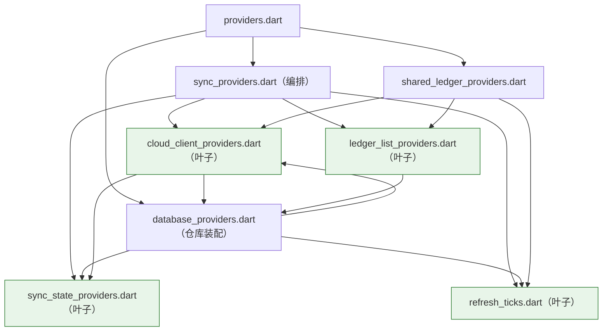
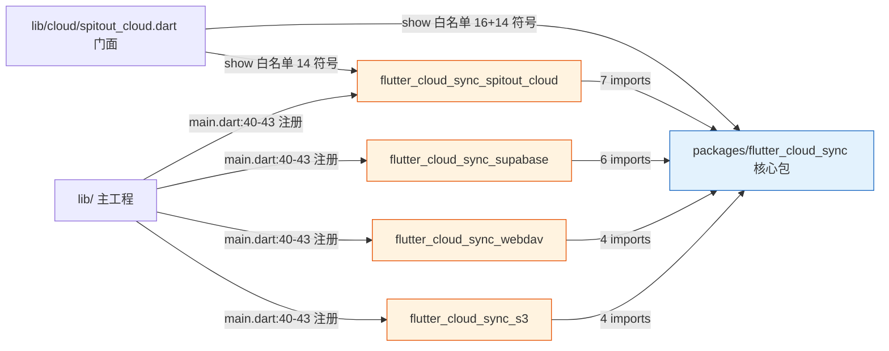
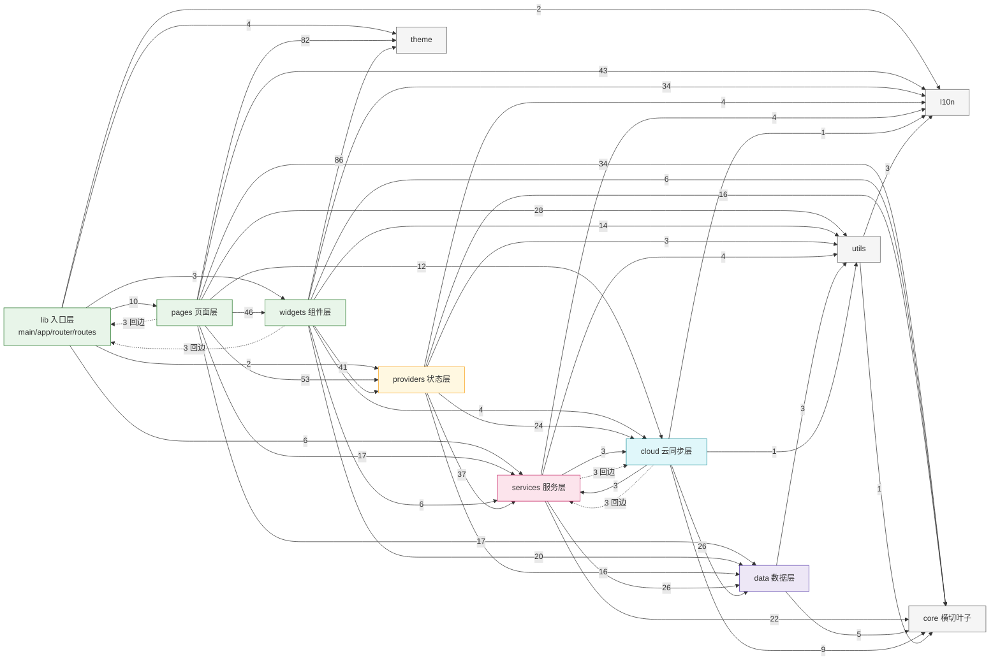

# Spitout 架构依赖与调用链分析报告

> 分析时间：2026-08-10（代码快照：`main` @ `f0647f9` release 1.2.11）
> 分析类型：feature（静态架构分析，无代码改动）
> 工具：自研 Dart import/export 扫描器 + Tarjan SCC + `flutter analyze --no-pub` + 人工精读

---

## 0. 项目概览

| 项目 | 说明 |
|---|---|
| 应用 | Spitout 个人记账（含多账本、共享账本、AA 分摊、多币种、提醒、本地备份、云同步） |
| 技术栈 | Flutter 3.44.6 / Dart 3.12，Riverpod 3.4.2，Drift 2.34.0（SQLite），`flutter_cloud_sync` 插件化云同步框架 |
| 代码规模 | `lib/` 262 个 Dart 源文件；`packages/` 5 个本地包共 59 个源文件（合计 307，已剔除 `*.g.dart` 与生成文件）；`test/` 259 个测试文件，`integration_test/` 1 个 |
| 数据库 | Drift 14 张表（业务表 + `local_changes` / `sync_state` / `sync_pull_errors` / `snapshot_dirty_ledgers` 同步信号表），schema 快照 v1~v5 位于 `drift_schemas/` |
| 分层骨架 | `lib_root(pages/widgets) → providers → services → data`；`cloud` 作为横向同步能力；`core/l10n/theme/utils` 为叶子支撑 |
| 同步架构 | **双栈并存**：Spitout Cloud 走「实体级增量」（ChangeTracker + SyncEngine + SyncCoordinator）；WebDAV/S3/Supabase 走「整本快照」（SnapshotDirtyTracker + TransactionsSyncManager + SnapshotSyncCoordinator）。两者因后端协议能力不同而不可合并 |
| 静态检查 | `flutter analyze --no-pub`：**0 error / 0 warning / 0 info**（159.7s）；CI 另有架构门禁（`rg` 扫描 `lib/` 禁直连 adapter 包，仅豁免门面与 Composition Root） |
| 仓库根 `data/` | 运行时数据（`.jwt_secret`、附件头像目录），**不是**源码层，不应与 `lib/data/` 混淆 |

---

## 1. 架构与目录结构详解（上下文补充）

### 1.1 目录树与模块清单

```
lib/
├─ main.dart / app.dart / router.dart / routes.dart   # 入口层（Composition Root + 路由）
├─ cloud/                                             # 云同步横向能力
│  ├─ spitout_cloud.dart                               # Spitout Cloud 白名单门面（唯一 adapter 感知点）
│  ├─ auth_error_localizer.dart                        # 认证异常 → 本地化文案
│  └─ sync/                                            # 同步引擎（20 文件，8 个 part 拆分的 SyncEngine）
├─ core/                                              # 横切叶子：identity / logging
├─ data/                                              # 数据层
│  ├─ db.dart + db.g.dart                              # Drift schema（生成文件不计入分析）
│  ├─ models.dart                                      # 数据模型门面（UI 唯一数据模型入口）
│  ├─ models/                                          # 领域模型（sync_models/ledger_kind/import_models…）
│  └─ repositories/
│     ├─ base_repository.dart / 领域 repository 接口
│     ├─ local/                                        # LocalRepository + 各 local_* 实现
│     └─ support/                                      # ChangeRecorder / SnapshotDirtyMarker 端口 + 异常
├─ l10n/                                              # 本地化（gen-l10n 生成 + arb）
├─ pages/                                             # 页面层（43 文件，auth/calendar/category/cloud/currency/data/main/…）
├─ providers/                                         # 状态层（Riverpod，34 文件）
│  ├─ providers.dart                                    # barrel 门面（all_providers 已并入）
│  ├─ core/                                            # database_providers / seed / security / refresh_ticks…
│  ├─ sync/                                            # sync_providers（编排）+ 叶子模块
│  ├─ ui/ statistics/ category/ currency/ …            # 领域 provider
├─ services/                                          # 服务层（36 文件，backup/cloud/currency/data/export/import/…）
├─ theme/                                             # 主题叶子（colors/typography/icons…）
├─ utils/                                             # 纯工具叶子（currency/date/format…）
└─ widgets/                                           # 通用组件层（68 文件 + widgets.dart barrel）

packages/
├─ flutter_cloud_sync/                                # 核心包：契约 + 注册表 + CloudSyncManager + 配置存储
├─ flutter_cloud_sync_spitout_cloud/                  # Spitout Cloud 私有协议适配器（HTTP + WS + 2FA）
├─ flutter_cloud_sync_supabase/                       # Supabase 适配器
├─ flutter_cloud_sync_webdav/                         # WebDAV 适配器
└─ flutter_cloud_sync_s3/                             # S3/R2/MinIO 适配器（含 SigV4 签名）
```

### 1.2 分层架构说明

**依赖方向契约**（与 AGENTS.md 一致）：

```
entry / pages / widgets  →  providers  →  services  →  data
         │                    │              │           │
         └────────────  cloud（横向同步能力）  ────────────┘

core / l10n / theme / utils：纯叶子，只被上层依赖，不反向依赖业务。
```

门面约定：
- UI 取数据模型：`data/models.dart`（barrel，禁止直连 `db.dart`）；
- UI 取状态/动作：`providers.dart`（barrel，禁止散落 import provider 子目录内部文件）；
- 云同步类型：`cloud/spitout_cloud.dart`（白名单 show，禁止除 `main.dart` 外直连 adapter 包）。

### 1.3 关键设计决策

1. **双栈同步引擎并存的原因（协议不可删）**
   - Spitout Cloud：服务端提供行级 `sync_changes` 增量日志（pull by cursor）、WebSocket 实时事件、共享账本/邀请/成员 API。本地必须记录实体级变更（`local_changes` 表）才能增量回放，故走 `ChangeTracker → SyncCoordinator → SyncEngine`。
   - WebDAV/S3/Supabase：无行级查询能力，只能整本 JSON 快照上传/下载。本地只需账本级脏标记（`snapshot_dirty_ledgers` 表），故走 `SnapshotDirtyTracker → SnapshotSyncCoordinator → TransactionsSyncManager`。
   - 两套协调器各自注释明确「请勿误删」，属于**设计意图**而非重复实现。

2. **数据层依赖倒置（端口注入）**
   - `data/repositories/support/change_recorder.dart` 定义 `ChangeRecorder` 抽象，`cloud/sync/change_tracker.dart` 实现；`LocalRepository` 只依赖抽象，装配点统一在 `providers/core/database_providers.dart` 的 `repositoryProvider`（按 `CloudBackendType` 二选一注入 ChangeTracker 或 SnapshotDirtyTracker，二者互斥）。

3. **同步触发下沉（规则 4）**
   - UI 写库后**不直接**调 `sync()`；写入 `local_changes` / `snapshot_dirty_ledgers` 后由 Coordinator 的 Drift `watch()` 监听 + 防抖（250ms / 500ms）自动触发。`PostProcessor` 只负责清状态缓存与 bump tick，双保险机制有注释登记。

4. **插件化适配器**
   - 核心包只定义 `CloudProvider` / `CloudAuthService` / `CloudStorageService` 等契约与 `CloudProviderRegistry`；各 adapter 在自己的库入口暴露 `register*Backend()`，由 `main.dart` 4 行注册完成装配；核心包不感知任何 adapter。

5. **Provider 叶子模块拆分（历史环消除）**
   - 曾存在 `database_providers ↔ sync_providers` 互引环。现拆出 `sync_state_providers.dart`（云配置 + tick）、`refresh_ticks.dart`（跨域 tick + 首页缓存）、`cloud_client_providers.dart`（云客户端/引擎基础设施）、`ledger_list_providers.dart`（账本列表）四个叶子，`sync_providers.dart` 只做编排并对叶子 re-export；`database_providers.dart` 只依赖叶子。依赖图已无环。

### 1.4 Provider 叶子模块依赖示意



该子图是 DAG：叶子模块只允许被依赖，不反向 import 编排模块；环通过「叶子 + re-export 保可见性」消除，消费方（`providers.dart` barrel）符号面不变。（分析期间远端合入的 8e1ee41 已把原 `all_providers.dart` 并入 `providers.dart`，图示为修正后形态。）

---

## 2. 模块依赖图（Mermaid）

### 2.1 顶层图：`lib/` ↔ `packages/`



**结论**：包级图**无环**，严格单向 `adapter → core ← 主工程`。唯一「主工程直连 adapter」的点是 `lib/main.dart`（注册）与 `lib/cloud/spitout_cloud.dart`（白名单 re-export），与 CI 架构门禁豁免名单一致。

### 2.2 详细层图：`lib/` 内部

边的权重 = 源文件数（import/export 语句条数，基于分析快照）。



### 2.3 图后说明

- **横切热点属正常**：`l10n/app_localizations.dart` 入度 94、`core/logging/logger_service.dart` 入度 91、`theme/colors.dart` 入度 87、`theme/icons/app_icons.dart` 入度 67，均为高入度叶子，不参与分层健康度判断。
- **两条虚线回边构成目录级 SCC**：
  - `cloud ↔ services`（3+3）：真实业务耦合，见 §4.4；
  - `lib_root ↔ pages/widgets`（pages→root 3、widgets→root 3 均为 `routes.dart` 纯常量导入；root→pages/widgets 为入口装配导入），属轻量环，见 §4.5。
- `providers → services`（37）与 `services → data`（26）为主干链路；`providers → cloud`（24）是云状态编排，符合「cloud 横向能力」定位。
- `pages/widgets` 到 `data` 的 37 条边**全部经由 `data/models.dart` 门面**，无直连 `db.dart`；唯一例外是 2 处 widgets 直连 data 内部文件（见 §7-中）。

---

## 3. 关键调用链（表格）

> 行号基于 2026-08-10 快照；`→` 表示同步/异步调用，`⇒` 表示事件/监听触发。

### 3.1 应用冷启动装配

| 步骤 | 调用序列 |
|---|---|
| ① | `lib/main.dart:40-43` `registerSupabaseBackend() / registerWebDavBackend() / registerS3Backend() / registerSpitoutCloudBackend()` → `CloudProviderRegistry.register(CloudBackendType, builder)`（核心包） |
| ② | `lib/main.dart:56-60` 通知初始化（`NotificationFactory.initializeTimeZone()` → `getInstance().initialize()`）；`lib/main.dart:71-76` `ReminderMonitorService().startMonitoring()` |
| ③ | `lib/main.dart:83` `ProviderContainer(retry:…)`；`lib/main.dart:99-102` `await Future.wait([container.read(welcomeCheckProvider.future), container.read(appSplashInitProvider.future)])` |
| ④ | `lib/providers/ui/ui_state_providers.dart:58` `appSplashInitProvider` → `themeModeInitProvider` / `appInitProvider` / `expenseColorSchemeInitProvider` / `displayNameInitProvider` / `securityInitProvider` / `visibleCurrenciesInitProvider`（并行）→ `repositoryProvider` 装配 ChangeTracker/SnapshotDirtyTracker（`database_providers.dart:50-110`）→ 首屏月度统计 + 前 20 条交易预加载 → 异步生成周期交易 → `PostProcessor.runR` |
| ⑤ | `lib/main.dart:104-107` `runApp(UncontrolledProviderScope(container, MainApp))`；`MainApp._getHomePage` 按 `welcomeCheck / appInitState / isAppLocked` 分发（`main.dart:140-175`） |
| ⑥ | `lib/app.dart:59` `ref.read(appStartupSyncProvider).start()` → `lib/providers/sync/app_startup_sync.dart:57` eager-await `spitoutCloudProviderInstance`（恢复 session）→ `lib/providers/sync/sync_providers.dart:113` `syncServiceProvider` 装配 `SyncEngine`（含 `engine.startListeningRealtime()`、`SyncCoordinator.start()`、connectivity 监听）→ `app_startup_sync.dart:74-98` `engine.syncAccount()` 首轮账户级同步 |
| ⑦ | `lib/app.dart:70` `autoBackupOnLaunch(ref.read)`（每日首次打开本地备份） |

### 3.2 核心业务写入（记一笔）

| 步骤 | 调用序列 |
|---|---|
| ① | `lib/widgets/transaction_editor_sheet.dart:401` `repo.addTransaction(...)`（`repositoryProvider` 解析为 `LocalRepository`） |
| ② | `lib/data/repositories/local/local_repository.dart:394` `addTransaction` → `:441` `db.transaction(...)` → `:461` `changeTracker.recordLedgerChange(entityType:'transaction', action:'create', ...)`（与写库同事务，保证回滚一致） |
| ③ | `lib/cloud/sync/change_tracker.dart:224` `_insert` → 写 `local_changes` 表（`pushedAt=null`）→ Drift `tableUpdates` 广播 |
| ④ | `lib/providers/core/database_providers.dart:14` `dataChangeSignalProvider` 命中 → 统计/列表/分类 provider 自动重算（不再依赖手动 bump） |
| ⑤ | `lib/widgets/transaction_editor_sheet.dart:447` 保存后 `PostProcessor.run(ref, ledgerId:)` → `lib/providers/core/post_processor.dart:132` `_doSync`：仅 `sync.markLocalChanged` + 状态 tick，**不直接调 sync()** |
| ⑥ | `lib/cloud/sync/sync_coordinator.dart:39` `start()` 的 `local_changes` watch 命中 → `:61` 250ms 防抖 → `:64` `engine.triggerAutoSync(reason:'local_change_detected')` |

### 3.3 反应式自动同步（Spitout Cloud 增量）

| 步骤 | 调用序列 |
|---|---|
| ① | `lib/cloud/sync/sync_engine_realtime.dart:126` `triggerAutoSync` → `:67` `_scheduleAutoSync`（2s 防抖 + `_autoSyncing` 单飞） |
| ② | `:94`（WS/网络恢复类 reason）`syncLedgersFromServer()` + `_refreshAllSharedResourcesAfterReconnect()` |
| ③ | `syncAccount()`（`sync_engine.dart:1142`）：Phase 1 用户级（profile / storage.list / pull('') / pushUserGlobalEntities）→ Phase 2 逐账本 fast-skip / fullPush / 增量 push + pull |
| ④ | 增量 push：`sync_engine.dart:1969` `push(ledgerId)` → `:1992` `_doPush` → `changeTracker.getUnpushedChangesForLedger` → `entity_serializer.dart` 序列化 → `provider.pushChanges(...)`（adapter HTTP）→ `changeTracker.markPushed(ids)` |
| ⑤ | 增量 pull：`sync_engine.dart:2150` `pull(ledgerId)` → `:2198` `_doPull` → `provider.pullChanges(since:cursor)` → `sync_engine_apply.dart:16` `applyRemoteChange`（6 种 entityType 幂等 upsert）→ `appCursor.commit(serverCursor)` |
| ⑥ | 结果广播：`_emit(PushCompleted / PullCompleted)`（`sync_engine.dart:149`）→ `sync_providers.dart:172-238` 事件监听 → `syncStatusRefreshProvider.tick()` / `ledgerListRefreshProvider.tick()` / `invalidate(currentLedgerProvider)` / `homeSwitchToStreamProvider.tick()`（仅 applied>0 才全量刷新） |
| ⑦ | 其他触发源：`sync_providers.dart:246` 切账本 → `triggerAutoSync('ledger_switched')`；`:264` `Connectivity().onConnectivityChanged` → 500ms 防抖 → `triggerAutoSync('connectivity_restored')` |

### 3.4 反应式自动同步（WebDAV / S3 / Supabase 快照）

| 步骤 | 调用序列 |
|---|---|
| ① | 写库：`local_ledger_repository.dart:278-280` / `local_repository.dart:489-491` `snapshotMarker.markLedgerDirty(ledgerId)` → `snapshot_dirty_tracker.dart:31` 写 `snapshot_dirty_ledgers`（INSERT OR IGNORE） |
| ② | `lib/cloud/sync/snapshot_sync_coordinator.dart:68` `start()`（含启动 `_scanNow()` 补扫残留）→ `:88` 500ms 防抖 |
| ③ | `:127` `syncService.uploadCurrentLedger(ledgerId)` → `lib/cloud/sync/transactions_sync_manager.dart:160`：`exportTransactionsJson(db, ledgerId)` → `CloudSyncManager.upload(data, path, metadata)`（adapter 快照上传）→ 成功 DELETE 脏信号行 |
| ④ | 下行：`transactions_sync_manager.dart:274` `pullIncremental` → `download` → `sync_diff_service.dart:82` `computeDiff`（本地 vs 云端）→ 支持 `downloadAndPreview` 供 `sync_preview_dialog.dart` 预览 → `applySyncChanges` 落库 |
| ⑤ | 状态：`transactions_sync_manager.dart:377` `getStatus`（本地指纹 vs 云端指纹），由 `sync_status_provider` 缓存供 UI |

### 3.5 登录 / 认证（Spitout Cloud，含 Provider 失效重建）

| 步骤 | 调用序列 |
|---|---|
| ① | `lib/pages/auth/login_page.dart:389` `auth.signInWithAccount(account, password)` → `authServiceProvider`（`cloud_client_providers.dart:173`）→ adapter `SpitoutCloudAuthService`（2FA 场景经 `main.dart:89-98` 注入的 `globalTwoFactorHandler` 弹 `Login2FAChallengeDialog`） |
| ② | 登录成功后：`:406` `ref.invalidate(authServiceProvider)` → `:412` `ref.invalidate(spitoutCloudProviderInstance)` → `:416` `ref.invalidate(syncServiceProvider)`；三者级联重建（`spitoutCloudProviderInstance` 内 `setRecoveryCredentials` + `currentUser` 恢复 session） |
| ③ | `:421` `syncStatusRefreshProvider.tick()` → `:426` `bottomTabIndexProvider.set(3)` → pop 登录页 |
| ④ | 登录态响应式广播：`cloud_client_providers.dart:283` `cloudCurrentUserProvider`（`_seedThenFollow`：先 yield `auth.currentUser` 快照，再 yield `authStateChanges` 实时流）→ UI 账号行/2FA 行/同步面板自动刷新 |
| ⑤ | 登出：`signOut()` → auth 状态流发出 null → 同链路反向刷新；`syncServiceProvider` 降级为 `LocalOnlySyncService` 或重建 |

### 3.6 首页列表 / 统计读取

| 步骤 | 调用序列 |
|---|---|
| ① | `lib/pages/main/home_page.dart:466-469` `watch(selectedMonthProvider)` + `watch(currentLedgerProvider)` → `database_providers.dart:145` `currentLedgerProvider`（StreamProvider）→ `repositoryProvider.watchLedger(ledgerId)`（Drift watch 流，云端同步改行自动重放） |
| ② | `home_page.dart:763` `repo.watchTransactionsWithCategoryInMonth(ledgerId, month)` → StreamBuilder 订阅（`home_page.dart:1159` 缓存流避免重建闪空） |
| ③ | 统计卡片：`home_page.dart:882-887` `watch(monthlyTotalsProvider / todayExpenseProvider / weekExpenseProvider)` → `statistics_providers.dart:25/52/75` 均 `watch(dataChangeSignalProvider)` + `repositoryProvider` 聚合 SQL |
| ④ | 账本列表：`ledger_list_providers.dart:33` `localLedgersProvider` → `watch(ledgerListRefreshProvider)` + `watch(dataChangeSignalProvider)` + `repo.getAllLedgers() + getAllLedgerStats()`（单条聚合 SQL，避免 N+1） |
| ⑤ | 下拉刷新：`home_page.dart:262-266` `sync.pullIncrementalWithHeal(ledgerId)`（纯本地账本只做本地刷新，不走云端）→ 完成后 tick 刷新 + 结果文案 |

### 3.7 跨端同步：上行 / 下行 / Profile 双向

| 步骤 | 调用序列 |
|---|---|
| ① | 上行（增量）：见 3.3-④；上行（快照）：见 3.4-③ |
| ② | 下行：`sync_engine_realtime.dart:418` `_schedulePull(ledgerId)`（`sync_change` / `backup_restore` WS 事件）→ `_doPull` → apply → `_emit(PullCompleted)` |
| ③ | WS 连接/重连：`sync_engine_realtime.dart:28-37` `connected` 事件 → `_scheduleAutoSync('ws_connected')`；`_scheduleAutoSync` 内对账共享资源（`_refreshAllSharedResourcesAfterReconnect`） |
| ④ | Profile 上行：`theme_providers.dart:56` `_pushAppearanceToCloud` / `:123` `_pushDisplayNameToCloud`（fire-and-forget `updateMyProfileAppearance/DisplayName`，仅 Spitout Cloud 模式） |
| ⑤ | Profile 下行：`sync_engine_realtime.dart:21-28` `profile_change` → `syncMyProfile()`（`sync_engine_profile.dart:20`）→ `_emit(ProfileFieldApplied)` → `sync_providers.dart:286-310` `_applyAppearanceFromServer / _applyDisplayNameFromServer`（先比较后写，避免 echo 环） |
| ⑥ | 头像：`sync_engine_profile.dart` 内 `uploadMyAvatar / downloadMyAvatar`，`AvatarChanged` 事件 → `avatarRefreshProvider.tick()` |

### 3.8 协作 / 共享（接受邀请、成员变更刷新）

| 步骤 | 调用序列 |
|---|---|
| ① | `lib/pages/cloud/join_shared_ledger_page.dart:69` `previewInvite(code)` → `shared_ledger_providers.dart:186` → `cloud.previewInvite(code)` |
| ② | `join_shared_ledger_page.dart:90` `acceptSharedLedgerInvite(code, ledgerExternalId)` → `shared_ledger_providers.dart:159` → `:137` `acceptInvite` → `cloud.acceptInvite(code)` → `:169` `engine.onInviteAccepted(ledgerExternalId)` |
| ③ | `sync_engine_realtime.dart:349` `onInviteAccepted`：`syncLedgersFromServer()`（拉新账本行）→ `_gcOrphanSharedLedgerRows()` → `fetchAndStoreSharedResources()`（写 SharedLedgerCategories 镜像）→ `replayAllChanges()`（sinceOverride=0 重放历史交易）→ `_emit(PullCompleted)` |
| ④ | UI 强力刷新：`shared_ledger_providers.dart:174-175` `invalidate(localLedgersProvider)` + `ledgerListRefreshProvider.tick()` |
| ⑤ | 成员实时刷新：`sync_engine_realtime.dart:133` `_handleMemberChange`（`member_change` WS 事件）：自己被踢 → `_purgeLocalLedgerByExternalId`；自己 joined（web 端 accept 场景）→ `syncLedgersFromServer + replayAllChanges`；他人 joined/角色变化 → `syncLedgersFromServer` 重拉成员数 |
| ⑥ | Owner 分类变更 fan-out：`sync_engine_realtime.dart:190` `_handleSharedResourceChange` → `_emit(SharedResourceChanged)` → `sharedResourceRefreshProvider.tick()` → 编辑器分类选择器/反查 widget 重建 |

---

## 4. 循环依赖检测

### 4.1 SCC 汇总（Tarjan，307 文件）

| # | 级别 | 成员 | 性质 | 处置 |
|---|---|---|---|---|
| 1 | 文件 | `l10n/app_localizations.dart` ↔ `app_localizations_{en,ko,zh}.dart`（4 文件互 import） | gen-l10n 标准输出模式 | 良性，不处理 |
| 2 | 文件 | `widgets/ledger_currency_change.dart:9` ↔ `widgets/widgets.dart:54`（export 回边） | 组件反向 import barrel | 需修复（低） |
| 3 | 目录 | `cloud ↔ services`（6 条跨目录边） | 真实业务耦合 | 需修复（高） |
| 4 | 目录 | `lib_root ↔ pages ↔ widgets`（10 条边，其中 pages/widgets→root 各 3 条是 `routes.dart`） | 常量叶子放错位置 | 建议修复（低） |

### 4.2 l10n SCC（良性）

`app_localizations.dart:8-10` import 三个语言文件；三个语言文件 `:3` 反向 import 基类。这是 `flutter gen-l10n` 的既定生成结构，无运行时环风险，**不应手工拆解**（拆解后生成器会重新生成）。

### 4.3 widgets barrel 自环

证据：
- `lib/widgets/ledger_currency_change.dart:9` `import 'widgets.dart'`；
- `lib/widgets/widgets.dart:54` `export 'ledger_currency_change.dart'`。

成因：组件实现图省事从 barrel 取符号，而 barrel 又导出该组件，形成编译期互依赖。

解耦方案：`ledger_currency_change.dart` 改为只 import 实际用到的兄弟文件（如 `../theme/*`、`../providers/...`），并保持「子文件禁止 import 自身 barrel」的约定（与 providers barrel 现有防护注释一致）。落地方式：先看该文件用到哪些符号，替换为直接 import；回归跑 `flutter analyze` 即可验证。

### 4.4 cloud ↔ services 目录环（高）

环内边：

| 方向 | 边（文件:行） | 用途 |
|---|---|---|
| cloud → services | `lib/cloud/sync/sync_diff_service.dart:5` → `services/import/data_import_service.dart` | 快照 diff/apply 复用导入落库逻辑 |
| cloud → services | `lib/cloud/sync/transactions_json.dart:7` → `services/import/data_import_service.dart` | fullPull 复用 `importTransactionsJson` |
| cloud → services | `lib/cloud/sync/sync_engine.dart:26` → `services/storage/avatar_storage.dart` | 头像同步读写本地存储 |
| services → cloud | `lib/services/cloud/cloud_connection_tester.dart:4` → `cloud/spitout_cloud.dart` | 连接测试复用云类型 |
| services → cloud | `lib/services/data/tx_author_service.dart:1` → `cloud/spitout_cloud.dart` | 交易作者归属解析云端用户 |
| services → cloud | `lib/services/export/config_export_service.dart:4` → `cloud/spitout_cloud.dart` | 配置导出含云配置 |

成因：
- `cloud/sync` 作为「同步实现」直接复用了 `services` 层的**导入/落库服务**与**本地头像存储**，违反 `cloud → data/core` 的应然方向；
- `services` 层本身依赖 cloud 门面是设计内允许的（cloud 为横向能力），**问题集中在 cloud→services 的三条回边**。

解耦方案（技术方向）：
1. `transactions_json.dart` / `sync_diff_service.dart` 需要的 JSON 导入逻辑下沉到 `data/`（或拆成纯函数叶子 `lib/core/sync_json/`），由 `data_import_service` 与 sync 侧共同调用，依赖方向变 `cloud → data`、`services → data`；
2. `avatar_storage` 改为「端口 + 注入」：在 `data/` 或 `core/` 层定义存储抽象端口（与 ChangeRecorder 同一套路；原 `core/storage/avatar_ports.dart` 已在 8e1ee41 被清理，需按当前 `AvatarStorage` 实现重新提炼），`SyncEngine` 只依赖抽象，由 providers 层注入实现；
3. 保留 `services → cloud` 三条边（单向、无环），作为横向能力消费。

### 4.5 lib_root ↔ pages ↔ widgets 目录环（低）

环内边：
- `lib/app.dart:7-11`、`lib/main.dart:19-20`、`lib/router.dart:4-7` → pages（入口装配，**设计意图**）；
- `lib/main.dart:13-14`、`lib/app.dart:14`、`lib/router.dart:3` → widgets（入口装配，**设计意图**）；
- `pages/main/home_page.dart:17`、`pages/main/mine_page.dart:9`、`pages/statistics/aa_statistics_page.dart:8`、`widgets/category_grid_section.dart:8`、`widgets/transaction_aa_edit_utils.dart:7`、`widgets/transaction_editor_sheet.dart:12` → `lib/routes.dart`（**纯常量，回边源**）。

成因：`routes.dart` 是零依赖常量类，却放在 `lib/` 根目录，导致页面/组件 import 它时产生「往上走」的边。环只包含常量引用，无运行时风险，但会污染 SCC 统计与依赖方向直觉。

解耦方案：把 `routes.dart` 移入叶子位置（如 `lib/core/router/routes.dart` 或 `lib/widgets/router_routes.dart`），所有引用点改路径即可；`router.dart` 的 `../widgets/app_route.dart` 写法（Dart 对 `lib/` 顶层文件特殊解析为 `lib/widgets/app_route.dart`）建议顺手改为 `widgets/app_route.dart`，消除歧义。

---

## 5. 外部依赖清单（声明 vs 实际使用）

### 5.1 全仓 import 广度（按文件数排序，含 lib + packages）

| 依赖 | 引用文件数 | import 次数 | 主要用途域 | 状态 |
|---|---:|---:|---|---|
| flutter | 134 | 158 | UI/框架 | 活跃 |
| flutter_riverpod | 100 | 106 | 状态层全部 | 活跃 |
| shared_preferences | 31 | 31 | 配置/会话/云配置持久化 | 活跃 |
| drift | 26 | 27 | 数据层 + 同步信号表 | 活跃 |
| intl | 15 | 15 | 日期/货币格式化 | 活跃 |
| uuid | 10 | 10 | 实体 syncId/本地身份 | 活跃 |
| decimal | 10 | 10 | 金额精度计算 | 活跃 |
| http | 8 | 9 | Spitout Cloud 认证/存储 + 更新检查 | 活跃 |
| supabase_flutter | 7 | 7 | Supabase 适配器（6）+ `auth_error_localizer`（1） | 活跃但耦合面越界（见 §7） |
| crypto | 7 | 7 | 指纹/签名/PIN 哈希 | 活跃 |
| path_provider | 6 | 6 | 数据库/备份/导出目录 | 活跃 |
| path | 5 | 5 | 路径拼接 | 活跃 |
| file_picker / share_plus / flutter_local_notifications / timezone / package_info_plus / flutter_secure_storage / meta | 各 3 | 各 3-4 | 导入导出 / 分享 / 提醒 / 版本 / 安全存储 | 活跃 |
| flutter_localizations / flutter_list_view / lucide_icons_flutter / fl_chart / webdav_client | 各 2 | 各 2 | 本地化 / 列表 / 图标 / 图表 / WebDAV 适配 | 活跃 |
| 其余单文件依赖（table_calendar、reorderable_grid_view、connectivity_plus、sqlite3、yaml、csv、gbk_codec、excel、local_auth、image_picker、permission_handler、url_launcher、flutter_svg、visibility_detector、xml、device_info_plus、web_socket_channel） | 各 1 | 各 1 | 各功能点 | 活跃（单薄但均有明确用途） |

### 5.2 pubspec 声明 vs 实际 import（按包）

| 包 | 声明但 0 import | 说明 |
|---|---|---|
| spitout（根） | `sqlite3_flutter_libs` | **设计保留**：无 Dart API，仅打包原生 SQLite 二进制供 Drift FFI 加载，pubspec 注释已声明「零 import 属正常，勿删」 |
| flutter_cloud_sync | 无 | `flutter_secure_storage`（凭据存储 1）、`shared_preferences`（配置 2）、`meta`（3）均被使用 |
| flutter_cloud_sync_s3 | 无 | `http/crypto/xml` 均被 S3 客户端使用 |
| flutter_cloud_sync_spitout_cloud | 无 | `crypto/device_info_plus/flutter_secure_storage/http/package_info_plus/shared_preferences/web_socket_channel` 全部被使用 |
| flutter_cloud_sync_supabase | 无 | `supabase_flutter`（6）、`flutter_secure_storage`（1）均被使用 |
| flutter_cloud_sync_webdav | **`http`** | `lib/` 与 `test/` 均无 `package:http` 引用；`webdav_client` 自带 HTTP 能力。建议从 pubspec 删除（或保留并在注释说明为后续 fallback 预留） |

### 5.3 单薄/异常依赖说明

- **supabase_flutter（根 pubspec 显式声明，仅 1 文件引用）**：`lib/cloud/auth_error_localizer.dart:6` 直接 import，用于把 `AuthApiException` 的 `.code` 映射成友好文案。这是唯一一条「主工程业务代码直连第三方后端 SDK」的边，也是适配器隔离的漏网点，建议按 §7-中方案收敛。
- **webdav 包 `http`**：声明未用，属可清理项。
- **flutter_cloud_sync 核心包 `meta`**：仅 3 处注解使用，属于轻量合理依赖。
- **`connectivity_plus`**：仅 `sync_providers.dart:4` 1 处使用，但承担「断网恢复触发同步」的核心职责，保留合理。

---

## 6. 插件化架构专项

### 6.1 依赖方向：单向、无环、核心包不感知适配器

- 图证据（§2.1）：4 个 adapter 包 → 核心包，边权 4~7；核心包对 adapter **零出边**（`CloudProviderRegistry` 只持有 `CloudBackendType → CloudServicesBuilder` 映射，无具体类引用）。
- 契约：`CloudProvider`（`src/core/cloud_provider.dart:8`）、`CloudAuthService`（`auth_service.dart:34`）、`CloudStorageService`（`storage_service.dart:46`）、`CloudDatabaseService` / `CloudRealtimeService` / `DataSerializer` 等由核心包定义，adapter 实现。
- 注册：`registerSpitoutCloudBackend()`（`flutter_cloud_sync_spitout_cloud.dart:21`）等顶层函数调用 `CloudProviderRegistry.register`；未注册后端在 `createCloudServices`（`provider_factory.dart:28`）抛 `StateError` 提示 Composition Root 装配。

### 6.2 Composition Root 装配

`lib/main.dart`：

| 行 | 代码 | 职责 |
|---|---:|---|
| 40-43 | `registerSupabaseBackend(); registerWebDavBackend(); registerS3Backend(); registerSpitoutCloudBackend();` | 4 行注册（4 个后端，非 3） |
| 89-98 | `SpitoutCloudProvider.globalTwoFactorHandler = ...` | 2FA 挑战回调（静态钩子注入 UI 能力） |
| 99-107 | `ProviderContainer` + 预加载 + `runApp(UncontrolledProviderScope(...))` | Riverpod 容器装配 |

符合插件化最佳实践：注册代码无业务逻辑、不 import 业务层、adapter 发现完全显式。唯一可讨论点：`globalTwoFactorHandler` 是静态全局，而非构造注入；当前仅单例场景，可接受，但若未来多后端并存建议改为实例字段。

### 6.3 barrel 健康度

| 包 barrel | exports | 消费情况 |
|---|---|---|
| `flutter_cloud_sync.dart` | 16 | `CloudProvider/AuthService/StorageService/CloudServiceConfig/Registry/Factory/CloudSyncManager/Logger/Exceptions/SyncStatus` 等均有消费者；`DataSerializer` 被 `transactions_sync_manager.dart:648` 实现；`CloudDatabaseService/RealtimeService` 被 Supabase 适配器实现；`PathHelper` 被 supabase/webdav 适配器使用。无「0 消费者」冗余导出 |
| `flutter_cloud_sync_spitout_cloud.dart` | 1（整桶） | 由主工程门面 show 白名单消费；`testing.dart` 仅供测试，0 生产消费者但设计合理（仿 `package:http/testing.dart`） |
| supabase / webdav / s3 桶 | 2-5 | 各自 `register*Backend` + Provider 类型，主工程门面/适配器内部消费，健康 |
| `lib/cloud/spitout_cloud.dart` | 2 组 show 白名单 | 业务侧唯一入口，符号面受控（防 `SyncStatus` 同名泄漏），健康 |

### 6.4 偏差与建议

1. **主工程 `auth_error_localizer` 直连 `supabase_flutter`**（见 §7-中）：破坏「核心包不含业务专属实现、主工程不直连后端 SDK」的隔离目标。建议在 Supabase 适配器内把 `AuthApiException` 归一化为 `CloudAuthException(code: ...)`，`auth_error_localizer` 只保留 `CloudAuthException` + 网络异常分支，根 pubspec 删除 `supabase_flutter`。
2. **核心包 `flutter_cloud_sync` 同时承担「通用快照管理（CloudSyncManager）」与「配置/凭据存储」**，职责可再拆，但当前规模（17 文件）可接受，不构成问题。
3. **Spitout Cloud 适配器规模偏大（11 文件，含 60+ 私有协议 API）**：属于业务私有协议，放进独立包符合隔离目标，无需再拆。

---

## 7. 架构一致性偏差（按严重度）

评分：**8.5 / 10**。分层主链干净、数据层端口倒置到位、同步触发下沉到位、插件化单向无环；扣分项集中在 cloud→services 回边、主工程直连 supabase SDK 与两处小环。

### 高

| # | 偏差 | 证据 | 修复方向 |
|---|---|---|---|
| H1 | cloud 层上行依赖 services 层（3 条边） | `lib/cloud/sync/sync_engine.dart:26 → services/storage/avatar_storage.dart`；`lib/cloud/sync/sync_diff_service.dart:5 → services/import/data_import_service.dart`；`lib/cloud/sync/transactions_json.dart:7 → services/import/data_import_service.dart` | JSON 导入逻辑下沉 `data/` 或 `core/` 纯叶子；头像存储改端口注入（同 ChangeRecorder 模式）；目标：`cloud → data/core` 单向 |
| H2 | 同步触发双保险存在「手工同步」旁路入口 | `lib/pages/main/home_page.dart:263-266`（下拉刷新直接调 `pullIncrementalWithHeal`）、`cloud_service_page.dart` 的 refresh/syncAccount 动作 | 用户主动手势同步属产品需求，**保留**；但需保持「自动同步唯一由数据变更驱动」：当前已满足（PostProcessor 不调 sync、Coordinator 统一监听），建议在代码注释中登记旁路为「用户主动手势豁免」，避免未来误删 |

### 中

| # | 偏差 | 证据 | 修复方向 |
|---|---|---|---|
| M1 | 主工程直连后端 SDK（supabase_flutter） | `lib/cloud/auth_error_localizer.dart:6`；根 `pubspec.yaml` 显式声明 `supabase_flutter` | 适配器内归一化异常类型；根 pubspec 移除 supabase_flutter；auth_error_localizer 只依赖核心包 `CloudAuthException` |
| M2 | widgets 组件反向 import 自身 barrel | `lib/widgets/ledger_currency_change.dart:9` ↔ `widgets.dart:54` | 该组件改直接 import 兄弟文件；同步把「子文件禁 import 自身 barrel」写入文件头注释 |
| M3 | 部分 UI 文件绕过 barrel 直连 provider 内部文件 | `lib/widgets/transaction_list_item.dart:10`、`lib/pages/category/category_template_flat_page.dart:8` 等直接 import `providers/core/database_providers.dart` | 属 Provider 叶子拆分后的**有意豁免**（代码注释已说明，避免环）；建议统一为「只允许叶子模块被直接 import，非叶子仍走 barrel」，并在 CI 门禁中显式放行叶子名单 |

### 低

| # | 偏差 | 证据 | 修复方向 |
|---|---|---|---|
| L1 | 纯常量 `routes.dart` 位于 `lib/` 根，制造 6 条「页面/组件 → 根」回边 | `pages/main/home_page.dart:17`、`widgets/transaction_editor_sheet.dart:12` 等 → `lib/routes.dart` | 移入 `core/router/` 叶子目录 |
| L2 | `router.dart` 使用 `../widgets/app_route.dart` 歧义写法 | `lib/router.dart:3`（依赖 Dart 对 lib 顶层文件的特殊解析） | 改为 `widgets/app_route.dart`，消除工具链/阅读歧义 |
| L3 | provider barrel 多层 re-export 放大耦合面 | `providers.dart → sync_providers.dart → 4 个叶子`（原 `all_providers.dart` 已并入 `providers.dart`） | 无环，可接受；建议在 `providers.dart` 标注「叶子已按域拆分，新增 provider 优先放叶子」，避免 barrel 无限膨胀 |
| L4 | `flutter_cloud_sync_webdav` 声明未用 `http` | `packages/flutter_cloud_sync_webdav/pubspec.yaml` | 删除声明，或加注释说明预留 |
| L5 | 数据层直连暴露 2 处 UI 细节 | `widgets/category_grid_section.dart:5 → data/repositories/category_repository.dart`（接口引用）、`widgets/transaction_edit_utils.dart:4 → data/repositories/support/shared_ledger_picker_filter.dart` | 若仅为类型/工具引用可保留；若涉及实现细节，收敛到 providers 接口或 `models.dart` |

### 已合规项（核对结论）

- UI 无直连 `db.dart`：pages/widgets 的 data 边全部经 `data/models.dart`（37 条边逐一核对）；
- 数据层无上行依赖（data 只依赖 core/utils 叶子）；
- 服务层不依赖 theme/UI 层（services 无 theme/pages/widgets 出边）；
- utils/theme/l10n 纯净（utils→core 1、utils→l10n 3 为日志/文案叶子依赖，theme/l10n 无业务出边）；
- 核心包不含业务专属实现（无主工程 import）；
- 自动同步不挂在 UI 点击上（UI 仅 `markLocalChanged` + tick，触发由 Coordinator 监听信号表）。

---

## 8. 清理建议清单（按优先级）

### 高

1. **消除 cloud→services 回边（H1）**：拆分 JSON 导入逻辑至 `data/` 或 `core/` 叶子；`AvatarStorage` 端口注入。完成后 `cloud ↔ services` SCC 应消失，`services → cloud` 保持单向。
2. **适配器 SDK 归一化（M1）**：Supabase 适配器把 `AuthApiException` 归一化为 `CloudAuthException`，主工程移除 `supabase_flutter` 直连与根 pubspec 声明。

### 中

3. **修复 widgets barrel 自环（M2）**：`ledger_currency_change.dart` 改直接 import 兄弟文件；`flutter analyze` 回归验证。
4. **Provider 叶子直连白名单化（M3）**：把叶子名单写入 CI 门禁注释/脚本，防止叶子无限扩散。
5. **webdav 包清理 `http` 声明（L4）**。

### 低

6. **移动 `routes.dart` 到 `core/router/`（L1）**：消除 lib_root 回边，目录级 SCC 归零（l10n 良性环除外）。
7. **修正 `router.dart` 相对导入写法（L2）**。
8. **barrel 新增符号纪律（L3）**：为 `providers.dart` / `widgets.dart` 增加「新增导出需符号级使用审计」的注释约束。
9. **测试代码死引用巡检（可选）**：`flutter analyze` 已覆盖 lib + test（0 告警），暂无需人工清理。

### 待废弃/保留说明

- `sqlite3_flutter_libs`（0 import）：**保留**（原生打包依赖）。
- `flutter_cloud_sync` 的 `CloudSyncManager` 与 `sync_service.dart` 的 `TransactionsSyncManager`：快照栈核心，**保留**；与增量栈（SyncEngine）的并存原因已双栈注释登记，不得删减。

---

## 附录

### 分析范围

- `lib/` 262 个源文件 + `packages/*/lib` 45 个源文件 = 307（已排除 `*.g.dart`、`*.freezed.dart`、`build/`、`.dart_tool/`）；
- 测试（`test/` 259 + `integration_test/` 1）未纳入依赖图，但纳入 `flutter analyze` 检查；
- `packages/flutter_cloud_sync/example/` 为独立示例，未纳入统计；
- 仓库根 `data/` 为运行时数据，非源码。

### 工具方法

1. **静态扫描**：自研 Python 脚本（`Temp/arch_scan.py`，分析完成后清理）递归解析 `import / export / part` 指令，映射 `package:` 与相对 URI 到仓库内文件；针对 Dart 对 `lib/` 顶层文件 `../x` 的特殊解析做了实验校准（实测 `lib/router.dart` 的 `../widgets/app_route.dart` 解析为 `lib/widgets/app_route.dart`）；
2. **环检测**：文件级与目录级有向图分别执行 Tarjan SCC；
3. **符号级搜索**：`rg` 追踪 Provider 读写、Repository 方法、Navigator、Stream/EventBus 事件，人工复核关键链路并标注文件:行号；
4. **静态检查**：`flutter analyze --no-pub`（0 告警），并交叉核对 pubspec 声明与 import 广度；
5. **CI 对照**：读取 `.github/workflows/test.yml` 与 `scripts/run_tests.ps1`，确认架构门禁、随机顺序测试要求与报告结论的一致性。

### 注意事项

- 行号基于 2026-08-10 快照（`f0647f9`），后续改动可能使行号漂移；
- 分析期间远端 `main` 合入 `8e1ee41`（清理单实现抽象与冗余格式化），报告已按 HEAD 修正 `providers.dart` barrel 形态与 avatar 端口描述；其余行号仍以 `f0647f9` 快照为准；
- 运行时依赖（Riverpod 动态重建、WS 事件时序、Drift watch 触发）基于代码语义人工还原，未做运行时插桩；
- 生成代码（`db.g.dart`、l10n）按惯例排除，但 l10n 的 4 文件 SCC 已单独说明；
- `flutter analyze` 结果与 CI 一致（0 error / 0 warning / 0 info），本报告未对代码做任何修改；
- 本报告不替代 CI 门禁：新增「叶子白名单」或「cloud→services 禁边」建议落地为脚本门禁前，仍需人工评审。
